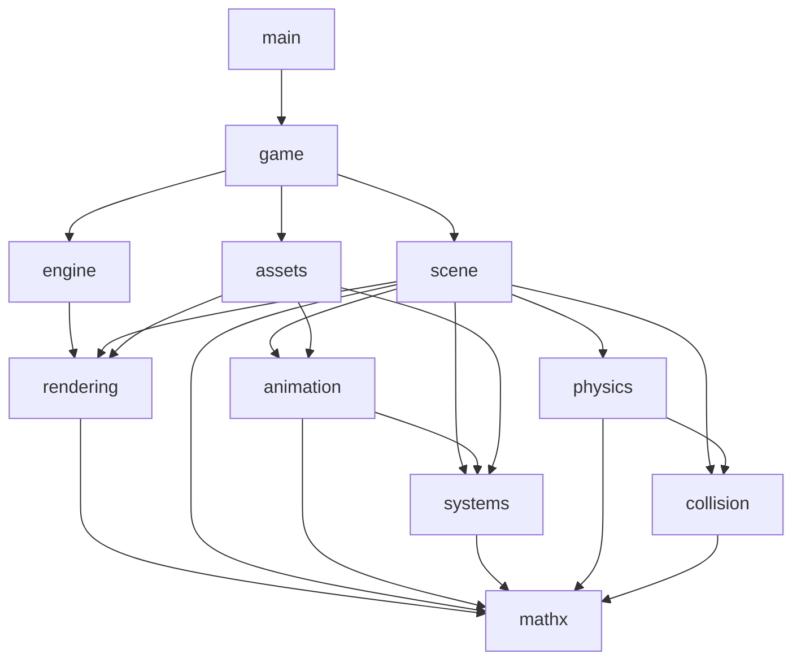
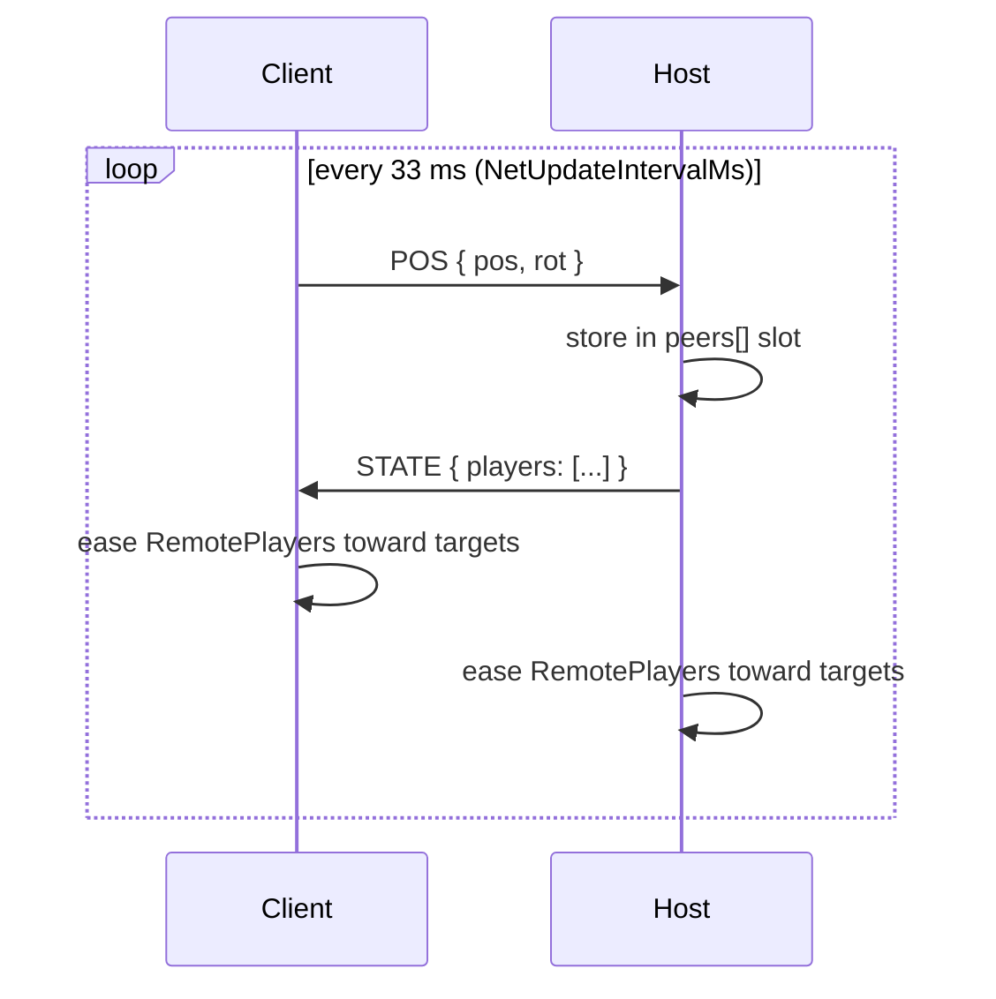

# Architecture

SimpleFPS is written in Go syntax and compiled by [GoFront](https://github.com/seriva/gofront) — to a seamless hybrid of JavaScript (ES modules) and WebAssembly (WasmGC). Collision runs in WebAssembly, mathx compiles to both targets, and the remaining packages run in JavaScript. Everything under `app/src` is a Go package or a `.templ` UI component; there is no hand-written JavaScript in the app. This document describes how the packages fit together, what each one owns, and the invariants the code is held to. Design history lives in `docs/plans/`.

## Package Layout

```
app/src/
├── main.go                  # package main: boot sequence
├── engine/                  # package engine: composition root, frame loop
│   ├── mathx/               # Vec3/Mat4/Quat/Transform/BoundingBox (target: both)
│   ├── collision/           # trimesh + octree, raycasts (target: wasm)
│   ├── physics/             # FPS controller, dynamic bodies (JS, calls into collision)
│   ├── systems/             # camera, settings, console, input, stats, sound, network, binary reader
│   ├── animation/           # skeletons, clips, animation player
│   ├── rendering/           # WebGPU backend, Renderer, passes, pipelines, WGSL, materials, meshes
│   │   └── fakegpu/         # in-memory GPUDevice recorder for headless tests
│   ├── scene/               # entities, culling, light grid, draw-list provider
│   └── assets/              # binary mesh/material/resource-list parsing, ResourceManager
└── game/                    # gameplay, UI (.templ), state machine, multiplayer
```

### Dependency direction



Rules the graph encodes:

- `mathx` imports nothing; it is the one leaf everything else may use. `collision` imports only `mathx`; `physics` only `mathx` and `collision`.
- `rendering` imports only `mathx`. It never sees `scene`, `systems` or settings; the renderer is fed through `SceneSource`, `CameraView` and `RenderOptions`. It is the only package that touches WebGPU; `rendering/fakegpu` is test-only and imported by `_test.go` files alone.
- Engine packages never import `game`. `game` and `main` may import anything.
- Settings (`systems.ActiveSettings`) are read in `engine` and `game` only. `engine.RenderFrame` copies them into `rendering.RenderOptions` once per frame; that is the only path settings take into rendering.

GoFront requires relative import paths (`"../mathx"`); that is a toolchain constraint, not a style choice.

### Compile targets

Each package declares where it runs with a `//gofront:target` directive on its first line (default `js`):

| Package | Target | Why |
|---|---|---|
| `mathx` | `both` | Pure float math used on both sides; the JS copy serves JS packages, the WASM copy is linked into `collision`. Struct types cross the boundary as live views, so a `*mathx.Vec3` made in JS can be passed straight into WASM. |
| `collision` | `wasm` | Octree traversal and ray/triangle tests are the hottest loop in the game; WASM keeps them branch-predictable and allocation-free. |
| everything else | `js` | Talks to the DOM, WebGPU, PeerJS. |

- **Cross-target determinism:** Code in `both` packages (`mathx`) is emitted by the JS backend in strict numeric mode (`Math.fround` on `float32` arithmetic, integer wrapping, divide-by-zero panics), guaranteeing identical results between the JS copy and the WASM copy.
- **No package-level mutable state:** `both` packages must not have mutable package-level variables since JS and WASM maintain separate module copies.
- `gofront build` emits `app.js` plus one `app.wasm` that bundles every `wasm`/`both` package; the JS facade for `collision` is generated, so callers see ordinary Go types. Hot calls must still obey the boundary rules in [Performance Invariants](#performance-invariants).

## Boot and Frame Loop

`main.boot()` runs once:

1. `systems.ActiveSettings.Load()`; mount console, menus, HUD, loading screen.
2. `engine.Init(onReady)` → `InitBackend` requires `navigator.gpu`; without it the engine stays unready and `onReady` still fires so the UI can report the failure. On success `InitWithBackend` creates `ActiveCamera` and `ActiveRenderer` (`Renderer.Init`: bind-group layouts, every pipeline, render targets, rings), registers console commands (`rscale`, `stats`, `settings`, `sstore`, `tnc`, `tbv/twf/tlv/tsk`) and the resize listener.
3. `systems.GlobalInput.Attach()`; `assets.GlobalResources.Init(backend)` and `Load(coreResources)`.
4. `game.NewDefaultGame()`, `g.Load("demo")` (arena, scene contents), `engine.SetCallbacks(g.Update, g.Multiplayer.Update)`, `g.Init()` (sets `engine.ActiveScene = g.Scene`).
5. `engine.Start()` — returns `ErrNoScene` (also logged to the console) if no scene is installed; otherwise schedules `requestAnimationFrame`.

Each animation frame (`engine.frameLoop`):

```
FrameStep(now)         GlobalInput.Update → alwaysUpdate(dt) → gameUpdate(dt) unless paused → ActiveCamera.Update
RenderFrame(t)         copy camera matrices into CameraView, copy settings into RenderOptions,
                       ActiveRenderer.Render(cameraView, ActiveScene, renderOptions, t), push Stats to the overlay
GlobalStats.Update
```

`alwaysUpdate` (multiplayer) keeps ticking while the game is paused in a menu; `gameUpdate` does not. `dt` is clamped to 100 ms.

`game.Game.Update(frameTimeMs)` accumulates time and runs the simulation at a fixed `FixedDT = 1/120 s`: controller update and move, then projectiles. After the fixed steps it syncs the camera from the controller, updates pickups against the player position, and calls `Scene.Update`, which runs entity callbacks, removes dead entities, culls, samples ambient probes and resolves drop-shadow heights for the frame that is about to be rendered.

## Rendering

### Backend abstraction

### Backend

`rendering.Backend` (`rendering/backend.go`) is the only code that talks to WebGPU. It is a thin, typed wrapper over `GPUDevice`/`GPUQueue`/`GPUCanvasContext` (declared in `rendering/interop.d.ts`): lifecycle (`Init` → `requestAdapter`/`requestDevice`/`configure`, `InitWithDevice` for tests, `BeginFrame`/`EndFrame` around one `GPUCommandEncoder` and one `queue.submit` per frame, `Resize`, `Dispose`), resource creation (`CreateBuffer`/`CreateFloatBuffer`/`CreateIndexBuffer`, `WriteBuffer*`, `CreateGPUTexture`/`WriteTexture`/`CopyImageToTexture`/`GenerateMipmaps`, `CreateSampler`, `CreateShaderModule`, `CreateBindGroupLayout`/`CreatePipelineLayout`/`CreateBindGroup`) and canvas geometry (`RenderScale`, `DoFSR`, swapchain vs. render size). There is no generic `RenderBackend` interface and no `any` handles: everything above the backend holds real `GPUBuffer`/`GPUTexture`/`GPURenderPipeline` values. Usage flags, formats and bind-group slots are Go constants in `rendering/gpu.go` so headless tests never need the WebGPU globals.

`rendering/fakegpu` is an in-memory `GPUDevice` written in Go. It implements the subset of the WebGPU API the backend uses and records what happens (buffers, textures, pipelines, bind groups, passes, draws, dispatches, writes, submits). `Backend.InitWithDevice(fakeDevice, fakeContext)` wires it in; the `rendering`, `scene`, `engine` and `assets` test suites render real frames against it and assert on pass order, pipeline selection, `ObjectData` contents and resource counts.

### Pipelines and bind groups

Every `GPURenderPipeline` and `GPUComputePipeline` is baked once in `Renderer.Init` (`rendering/pipelines.go`): `geometry`, `skybox`, `skinned-geometry`, `entity-shadows`, `skinned-entity-shadows`, `directional-light`, `point-light`, `spot-light`, `transparent`, `billboard`, `instanced-billboard`, `postprocess-swapchain`/`postprocess-scratch`, `fsr-easu`, `fsr-rcas`, `debug`, `skinned-debug`, plus the `kawase-blur` and `particle-update` compute pipelines and one `mipmap-<format>` blit per texture format. Blend, depth, cull and topology live in the pipeline descriptor; there is no runtime state cache. Double-sided materials use a pipeline's cull-disabled twin (`Pipeline.CullOff`).

All WGSL (`rendering/wgsl.go`) shares one four-slot bind-group contract (`GroupFrame`..`GroupLighting` in `gpu.go`):

| Group | Contents | Lifetime |
|---|---|---|
| 0 `frame` | `FrameData` uniform: view/projection matrices, camera position + time, viewport size + procedural-detail flag | one buffer, written once per frame |
| 1 `material` / pass inputs | `MaterialData` uniform + sampler + albedo/emissive/lightmap/noise/reflection textures; for lighting, blur, post-process, FSR and billboards the pass's input textures | cached on the `Material` (rebuilt when a texture changes) or built once per pass in `buildPassResources` |
| 2 `object` | `ObjectData` uniform with a dynamic offset into the 256-byte-slot `ObjectRing` (world matrix, probe, three `params` vec4s, `misc`) + the `BoneRing` storage buffer (`var<storage>` of `mat4x4`) indexed by `misc.x` | one bind group; `Renderer.NextObject()` hands out a slot per draw, `flushRings` uploads both rings in one `writeBuffer` each at the end of the frame |
| 3 `lighting` | `LightingData` uniform (ambient + counts) + `lights` storage buffer (3 `vec4` per light, up to `MaxSceneLights`) | written when the transparent pass has lights to forward-shade |

Skinning matrices and dynamic lights are storage buffers, so there is no per-draw bone upload and no fixed light slot count in the shader. Particle emitters own `particles`/`particle-instances`/`particle-curve` storage buffers that the `particle-update` compute shader advances inside the frame's compute pass; the `instanced-billboard` pipeline then draws the instance buffer directly.

### Frame

`Renderer.Render(cam, scene, opts, time)` is the only code that knows pass order, pipeline selection and GPU state. The scene hands it culled draw lists; each `Drawable` fills an `ObjectData` slot and issues its draw. Every pass is an explicit `GPURenderPassDescriptor` with its own load/store ops; nothing is lazily bound.

| Pass (label) | Target | Pipelines | Scene lists | Notes |
|---|---|---|---|---|
| `gbuffer` | G-buffer + depth, viewport depth 0.1–1.0 | `skybox`, `geometry`, `skinned-geometry` | `Skyboxes`, `Meshes`, `FPSMeshes`, `SkinnedMeshes` | Clears to ambient. FPS meshes drawn opaque here so they occlude like world geometry. Counts meshes/triangles. |
| `shadow` | shadow buffer (R8) | `entity-shadows`, `skinned-entity-shadows` | `Meshes`, `SkinnedMeshes` | Flattened drop shadows at each caster's resolved ground height; skipped when nothing casts. |
| `fps-geometry` | G-buffer, viewport depth 0.0–0.1 | `geometry` | `FPSMeshes` | Redraws view models in the near range so they layer over the world. |
| `lighting` | light buffer, additive | `directional-light`, `point-light`, `spot-light` | `DirectionalLights`, `PointLights`, `SpotLights` | Sorts point/spot lights by `LightScore` (intensity / distance²) once per frame; counts lights. Then Kawase-blurs the light buffer in a compute pass. |
| compute | storage buffers | `particle-update` | `ParticleEmitters` | `Drawable.Simulate` per emitter; one `dispatchWorkgroups` per emitter (64 particles per workgroup). |
| `transparent` | light buffer, alpha blend / additive | `transparent`, `billboard`, `instanced-billboard` | `Transparent`, `Billboards`, `ParticleEmitters` | Sorted lights are packed into the `lights` storage buffer for forward shading; skipped when all three lists are empty. |
| compute | emissive ↔ scratch | `kawase-blur` | — | `EmissiveIterations` ping-pong dispatches (odd counts add a copy-back). |
| `postprocess` / `postprocess-scratch` | swapchain, or scratch when FSR is on | `postprocess-*` | — | albedo × (lighting + emissive) + shadows + bloom + gamma + lens dirt + FXAA. |
| `fsr-easu`, `fsr-rcas` | FSR target → swapchain | `fsr-easu`, `fsr-rcas` | — | Only when `DoFSR`: upscale then sharpen. |
| `debug` | swapchain | `debug`, `skinned-debug` | all | Bounding boxes (colour per list), wireframes, light volumes, skeletons, per `Renderer.Debug`; pass is skipped when every toggle is off. |

G-buffer layout:

| Attachment | Format | Content |
|---|---|---|
| 0 | RGBA16F | World-space position |
| 1 | RGBA8 | Octahedral-encoded world normal |
| 2 | RGBA8 | Albedo; `a` = lightmap flag (1 = lightmapped/skybox, dynamic lights skip it) |
| 3 | RGBA8 | Emissive |

`RenderStats` (`MeshCount`, `LightCount`, `TriangleCount`) is reset in `Render` and read field-by-field by the stats overlay. `CaptureSnapshot` renders one frame and returns the canvas as a JPEG data URL.

### Baked lighting

- **Lightmaps** on static arena geometry: an RGB atlas multiplied into albedo in the geometry pass; such surfaces are flagged in `color.a` so dynamic lights do not double-light them.
- **LightGrid** (`scene/lightgrid.go`): a 3-D grid of RGB probes sampled on the CPU with trilinear interpolation and precomputed strides. `Scene.Update` samples it at every visible mesh's position into the entity's `Probe` cache; `Draw` writes it into the `ObjectData` probe slot. When a grid is loaded `Scene.Ambient` is black and the probe carries the ambient term.
- **Procedural detail**: static geometry layers parallax detail from a procedural noise texture (`rendering/noise.go`), toggled through `RenderOptions.ProceduralDetail`.

## Scene

`scene.Scene` is the entity registry and spatial side of the engine: it owns entity lifetime, runs updates, culls against the camera frustum, merges static geometry for raycasts, and fills the draw lists the renderer consumes. It never binds a shader or sets GPU state.

### Entity vs Drawable

```go
// package scene — what the Scene needs from every entity
type Entity interface {
    GetBase() *EntityBase
    Update(frameTime float32) bool   // false = remove
    Dispose()
}

// package rendering — what a pass needs from something it draws
type Drawable interface {
    Draw(r *Renderer, mode MaterialMode)
    DrawShadow(r *Renderer)
    DrawWireframe(r *Renderer)
    DrawSkeleton(r *Renderer)
    Simulate(r *Renderer, pass GPUComputePassEncoder)   // GPU-side updates (particles)
    Bounds() *mathx.BoundingBox
    TriangleCount() int
    CastsShadow() bool
}
type LightDrawable interface {
    Drawable
    LightScore(camPos *mathx.Vec3) float32
    AddToLighting(data *LightingData) bool
}
```

Concrete entity types implement `Entity` plus whichever drawing interface their kind needs; lights implement `LightDrawable`. `EntityBase` holds `Type`, `Visible`, `CastShadow`, `IsStatic`, `AnimationTime`, `BaseMatrix`/`AniMatrix`, `BoundingBox` (nil = always visible), `Collider` (`*collision.Trimesh` for dynamic raycasts), `UserData`, and the optional update `Callback`. Mesh-only per-frame state lives on `MeshEntity`/`SkinnedMeshEntity` as `Shadow shadowState` (resolved ground height, skinned re-sample tracking) and `Probe probeCache` (ambient probe RGB).

GoFront does not promote embedded fields, so every entity has an explicit `Base EntityBase` field and `GetBase()`; struct-typed fields are cloned on assignment, so callers mutate `e.Shadow.Height = …` in place and never copy the struct out.

Entity types and constructors:

| Type | Constructor | Draws in |
|---|---|---|
| `TypeMesh` | `NewMeshEntity` | world geometry, shadows, transparent (translucent materials) |
| `TypeFPSMesh` | `NewMeshEntity(TypeFPSMesh, …)` | world + FPS geometry |
| `TypeDirectionalLight` | `NewDirectionalLightEntity` | lighting (screen quad) |
| `TypePointLight` / `TypeSpotLight` | `NewPointLightEntity` / `NewSpotLightEntity` (degrees) | lighting (sphere / cone volumes) |
| `TypeSkybox` | `NewSkyboxEntity` | world geometry (depth off) |
| `TypeSkinnedMesh` | `NewSkinnedMeshEntity` | world geometry, shadows |
| `TypeAnimatedBillboard` | `NewAnimatedBillboardEntity(position, *BillboardConfig)` | transparent (additive) |
| `TypeParticleEmitter` | `NewParticleEmitterEntity` | compute (`Simulate`), transparent (one instanced draw) |

Entities never reach back into the scene; camera- and scene-dependent values are written onto them before drawing (`SkyboxEntity.CameraPosition`, `AnimatedBillboardEntity.CameraView`, probe colour, shadow height).

### Scene API

```go
s := scene.NewScene(camera)
s.AddEntity(e) / s.AddEntities(list) / s.RemoveEntity(e)
items, n := s.GetEntities(scene.TypeMesh)          // all entities of a type
items, n := s.VisibleMeshes()                      // culled this frame
items, n := s.VisibleSkinnedMeshes()
s.Update(frameTimeMs)                              // callbacks → removal → culling → probes → shadow heights
s.Pause(true)

s.AddStaticGeometry(meshEntity); s.FinalizeStaticGeometry()   // bake into one Trimesh
s.Raycast / RaycastStatic / RaycastDynamic(fx, fy, fz, tx, ty, tz, opts)
s.SetAmbient(r, g, b); s.Ambient(out); s.AmbientAt(pos, out); s.LightGrid()
```

Lists return `(items, count)` over fixed-capacity backing arrays — iterate to `count`, never `len(items)`. `Scene` implements `physics.RaycastProvider`; the game hands it to the `FPSController` and `DynamicBody` instances it creates. Nothing is registered through globals.

### Per-frame visibility

`Scene.UpdateVisibility` (called from `Update`) clears the draw lists, tests each entity's `BoundingBox` against `Camera.FrustumPlanes`, and pushes survivors into the `rendering.DrawList`/`LightList` for their type plus two typed buckets (`visibleMeshes`, `visibleSkinned`) the scene post-processes itself. After culling it:

- samples the ambient probe for every visible mesh, FPS mesh and skinned mesh;
- builds the `Transparent()` list: visible meshes with translucent materials sorted back to front by clip-space `w`;
- resolves drop-shadow heights: casters sorted by screen size, at most `shadowRaycastBudget = 16` static raycasts per frame; skinned casters re-sample every 3 frames or after moving more than 0.2 units.

The lists alias scene-owned storage and are valid until the next `Update`; passes must not add or remove entities mid-frame.

### Static geometry and raycasts

`AddStaticGeometry` bakes an entity's mesh into one world-space `collision.Trimesh` (with per-triangle double-sided flags for translucent/double-sided/alpha materials); `FinalizeStaticGeometry` builds its octree. `RaycastStatic` queries that trimesh, `RaycastDynamic` the colliders of non-static entities, `Raycast` both. Results are written into caller-provided `RaycastResult`s.

## Animation

`animation.Skeleton` holds joints with inverse-bind matrices; a `Pose` is flat per-joint position/rotation arrays. `ParseBinaryAnimation` reads clips (with optional per-frame bounds used for culling), `AnimationPlayer.Update(dtSeconds)` samples them, and `Skeleton.ComputeSkinningMatrices(pose)` writes into a reused `[]mathx.Mat4`. `SkinnedMeshEntity.PlayAnimation` drives the player and `Draw` appends the matrices to the renderer's `BoneRing` storage buffer, recording the base index in `ObjectData.misc.x`.

## Math, Collision and Physics

`mathx` is pure data and arithmetic: `Vec3`/`Mat4`/`Quat`/`Transform` with out-parameter math and `BoundingBox`. `collision` owns the world geometry queries: `Trimesh` + `Octree`, `Ray`/`RayOptions`/`RaycastResult`. `physics` owns the movers: `FPSController` (capsule movement, stepping, grounding, noclip) and `DynamicBody` (projectiles, pickups). Anything that needs the world passes it in: controllers and bodies hold a `RaycastProvider`, and the controller reads the camera through a `CameraPose` the game wires up.

## Systems and Assets

`systems` groups the engine-level services: `Camera` (projection/view/frustum planes), `EngineSettings` (`ActiveSettings`, persisted to `localStorage`), `ConsoleManager` (`GlobalConsole`: logging and the command registry — always log through it, never `console.*`), `InputManager` (`GlobalInput`, including the `.templ` virtual controls on mobile), `StatsOverlay` (`GlobalStats`), `Sound`, `Network` (see below) and `BinaryReader`.

`assets.ResourceManager` (`GlobalResources`) fetches, decodes and caches assets by path, choosing the decoder by extension (`.webp` textures, `.mesh`/`.bmesh` meshes, `.smesh`/`.sbmesh` skinned meshes, `.banim` clips, `.mat` material libraries, `.sfx` sounds, `.list` resource lists loaded recursively, raw `.bin`). `ParseBinaryMesh` decodes the binary mesh format including the skinning section. Generated assets under `app/resources/` come from the converters in `scripts/` and are never hand-edited.

## Game

`game.Game` composes the gameplay systems — `Arena` (map, spawn points, lights, static geometry), `PlayerState`, `WeaponSystem`, `ProjectileSystem`, `PickupSystem`, `Controls`, `Multiplayer` — around one `scene.Scene` and the engine camera. UI (`menus`, `hud`, `loading`, `console`, `stats`, `virtual_input`) is authored in `.templ` with a plain Go state machine (`StateManager`); all CSS is in `app/style.css` so `gofront dev` hot-swaps it. `UpdateManager` handles the PWA service-worker update flow.

## Networking

Multiplayer is **client-authoritative** peer-to-peer over WebRTC via PeerJS (bundled by `gofront prep`, typed in `app/src/dependencies/peerjs.d.ts`). `systems.Network` wraps a PeerJS `Peer` for both roles; `game.Multiplayer` drives it from the engine's `alwaysUpdate` callback so it keeps running while menus are open.



- Each player simulates its own physics and reports position/rotation; the host relays the full state. Clients never connect to each other.
- Packets are reused in place and `peers` is a fixed-size slice of pre-allocated `peerState`s — no per-packet allocation.
- `netvalidation.go` validates every incoming payload (finite numbers, expected shapes) before it touches game state.
- `RemotePlayer` eases toward the latest target with exponential decay (`RemotePlayerLerpDecay`).

Gameplay sync (pickups, hits, scores) is not implemented; the intended shape is "host as referee": clients claim pickups / report hits, the host confirms and broadcasts the result inside `STATE`.

## Performance Invariants

The frame path — physics step, raycasts, `Scene.Update`, `Renderer.Render`, HUD writes — allocates nothing. Heap-growth guards in the `physics`, `scene` and `rendering` test suites and the `tests/perf/zero-alloc.js` benchmark enforce it. The rules that keep it true under GoFront:

- Out-parameter math and caller-provided result buffers; package-level scratch vectors/matrices/slices.
- Fixed-capacity lists with a `Count` and swap-remove; growth only when capacity is exceeded.
- No `[N]T` literals, `append`, reslicing, comma-ok type assertions or struct-value copies on hot paths (all of them allocate in GoFront). Struct-typed fields (`Shadow`, `Probe`, `Stats`, `Debug`) are mutated field-by-field.
- Interface-type assertions (`x.(SomeInterface)`) compile to an unconditional success and must not be used for dispatch; concrete pointer assertions and type switches are fine.
- Method values are emitted unbound, so cross-package hooks are interfaces (`RaycastProvider`, `SceneSource`), never `func` fields assigned from methods.
- JS→WASM calls are allocation-free only when V8 can inline them: GoFront binds exports to module constants and crosses every reference as `externref`, so keep boundary signatures to numbers, bools and pointers to structs. Returning struct *values* or passing `any` across the boundary allocates. Results come back through caller-provided `*RaycastResult`s for that reason.

## Console Commands

| Command | Effect |
|---|---|
| `stats` | toggle the FPS / render-stats overlay |
| `rscale <0.2..1>` | set the render scale and reallocate targets |
| `settings` / `sstore` | dump / persist settings |
| `tnc` | toggle noclip |
| `tbv` / `twf` / `tlv` / `tsk` | toggle bounding volumes / wireframes / light volumes / skeletons (`Renderer.Debug`) |

## Testing

| Command | What runs |
|---|---|
| `npm run check` | Biome (JS files) + `gofront check app/src/...` |
| `npm test` | `gofront test app/src/...` headless, every package (dual-target `mathx [js]` and `mathx [wasm]`, `collision [wasm]`); `rendering/fakegpu` stands in for the GPU device so rendering, scene, engine and assets tests render real frames and assert on the recorded commands |
| `npm run test:dom` | the same under jsdom (`window`/`document` present) |
| `npm run test:perf` | `tests/perf/zero-alloc.js`: 100k raycasts under 64 KB of new-space growth |
| `npm run test:e2e` | `tests/e2e/smoke.spec.js` (Playwright, WebGPU; a Proxy mock device in headless runs): boot → menu → rendered frame |
| `npm run test:all` | all of the above |

New `.go` code gets a `_test.go` beside it; hot paths get a heap-growth test.
