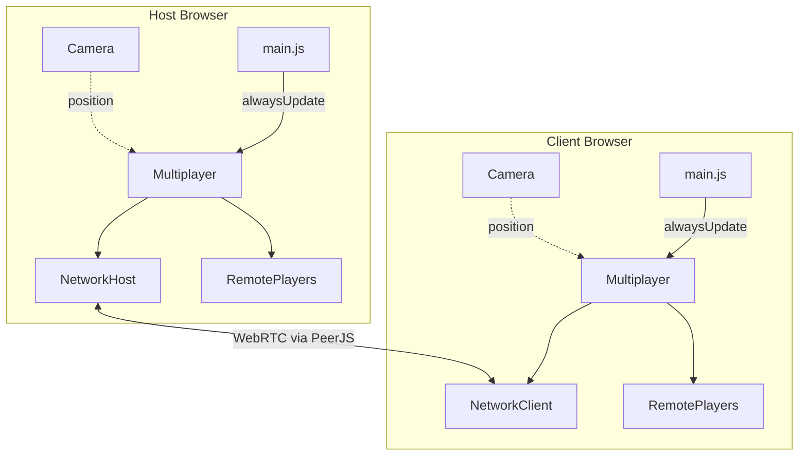
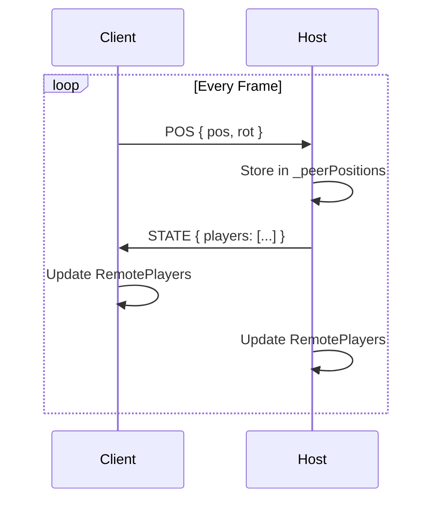
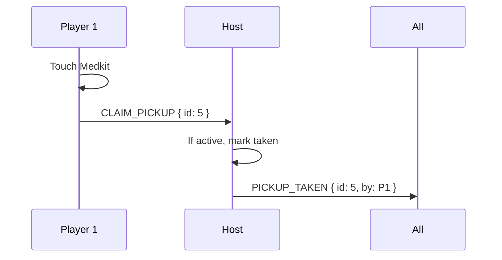
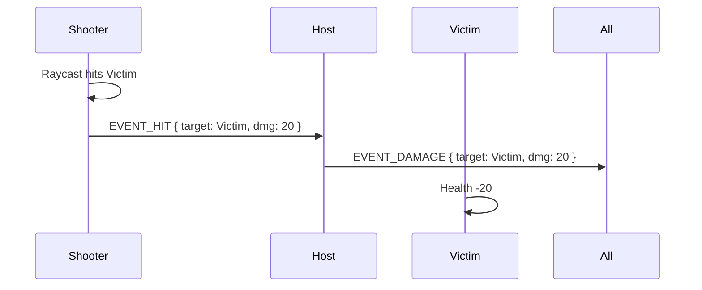

# Multiplayer Networking Architecture

## Overview

SimpleFPS uses a simplified **Client-Authoritative** networking model to enable multiplayer gameplay without a dedicated game server. It leverages [PeerJS](https://peerjs.com/) to establish direct WebRTC connections between a Host browser and Client browsers.

## File Structure

```
app/src/
├── game/
│   ├── multiplayer.js     # Main orchestrator (Host/Join/Update logic)
│   └── remoteplayer.js    # Visual representation of other players (prediction/smoothing)
└── engine/networking/
    ├── networkhost.js     # PeerJS wrapper for Host (accepts connections, broadcasts state)
    └── networkclient.js   # PeerJS wrapper for Client (connects to host, sends position)
```

## Component Relationships

The Host acts as a central relay. Clients do not connect to each other directly; they all connect to the Host.



## Data Flow: Position Synchronization

Since the game is **Client-Authoritative**, each player simulates their own physics locally and simply tells the Host "I am here". The Host collects these positions and broadcasts the full game state to everyone.

1.  **Client Update**:
    *   Reads local `Camera.position` and `Camera.rotation`.
    *   Sends `POS` message to Host: `{ pos: [x,y,z], rot: [pitch,yaw] }`.

2.  **Host Update**:
    *   Receives `POS` messages from all clients and updates its `_peerPositions` map.
    *   Reads its own local `Camera` position.
    *   Compiles a `STATE` message containing all player locations.
    *   Broadcasts `STATE` to all connected clients.
    *   Updates its own visual `RemotePlayer` entities.

3.  **Client Receive**:
    *   Receives `STATE` message.
    *   Updates `RemotePlayer` entities (lerping positions for smoothness).



## Extending for Gameplay (Deathmatch)

To support pickups, shooting, and scoring, the architecture can be extended using a **"Host as Referee"** model.

### 1. Pickups (The "Claim" System)
**Problem:** Two players touch a medkit at the same time.
**Solution:** Clients "claim" a pickup, Host confirms/denies.



### 2. Combat (The "Tattle" System)
**Problem:** Latency makes hitting moving targets inaccurate on the server.
**Solution:** Trust the shooter (Client-side hit detection).



### 3. Game State
The Host maintains the official game state (Score, Time, Pickup Status) and broadcasts it inside the `STATE` packet.

```json
{
  "players": [ ... positions ... ],
  "game": {
    "timeLeft": 230,
    "scores": { "A": 5, "B": 2 },
    "pickups": [true, false, true, true] 
  }
}
```
