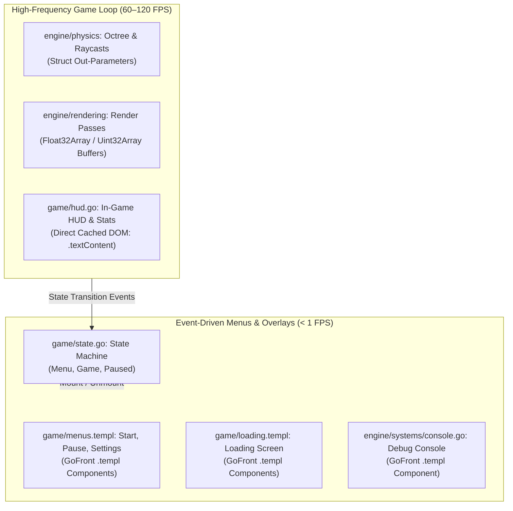
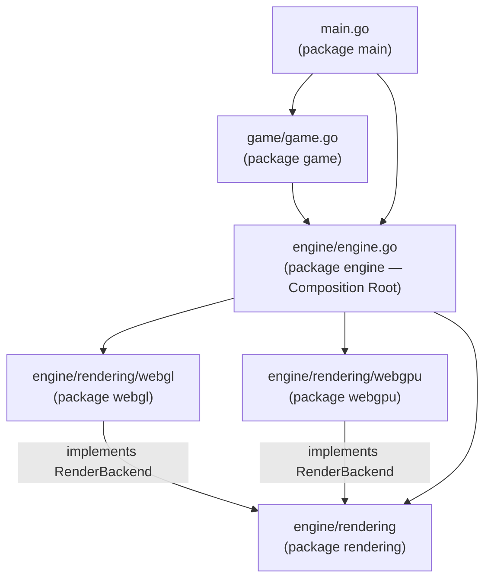

# GoFront Engine & Architecture Rewrite — Design Plan

**Version:** v2.1.0  
**Target Toolchain:** GoFront v1.3.7  
**Status:** In Progress — Phase 1, 2 & 3 complete on branch `gofront`  

---

## Toolchain Note

The `physics` and `systems` packages require GoFront **1.3.7 or later**, which
ships two compiler fixes surfaced by this port:

1. Pointer receivers are typed `*T` (previously `T`), so `return out` from a
   `func (out *Vec3) …` method type-checks and does not clone.
2. Omitted struct-typed fields of an *imported* struct type are zero-initialised
   (`new V()`) instead of `null`.

`gofront test --dom` (used by `npm run test:dom`) needs the `jsdom` devDependency.

## Branch State (`gofront`)

- `app/src/engine/physics/`, `app/src/engine/systems/`, and `app/src/game/` are Go packages with
  unit and integration tests (`gofront test`, headless and `--dom`).
- Mobile virtual controls are ported to `.templ` (`app/src/engine/systems/virtual_input.templ`).
- In-game HUD, state machine, menus, loading screens, and debug console are ported to GoFront
  (`.go` and `.templ` components) eliminating all `Reactive.js` dependencies.
- There is no `app/src/main.go` yet, and legacy `.js` modules remain side-by-side for next phases.

---

## Goal

Rewrite SimpleFPS from vanilla ES6 and Microtastic into a 100% type-safe, compiled GoFront architecture with zero-allocation hot paths, native WebGL2/WebGPU buffer manipulation, and native GoFront UI components.

The rewrite will **preserve the exact current folder structure and modular layout** (`app/src/engine/` and `app/src/game/`). All modules map 1-to-1 from `.js` to `.go` (and `.templ` for UI components). By leveraging GoFront v1.3.2 features (zero-allocation loops, TypedArrays, struct pointer unboxing, native `.templ` components, root test auto-detection, multi-file package type checking, and dual-directory dev watching), we eliminate runtime type ambiguity, replace `Reactive.js` with native GoFront patterns, remove `gl-matrix` and Microtastic dependencies, and deliver rock-solid 120+ FPS execution with 0 bytes allocated per frame in the game loop.

---

## Out of Scope

- **Altering the Folder Structure:** No artificial `pkg/` or Go-idiomatic monorepo restructuring. The directory hierarchy mirrors the existing SimpleFPS codebase directly.
- **Rewriting WebRTC/PeerJS from Scratch:** `peerjs` remains an external vendor dependency bundled via GoFront's built-in vendor bundler (`gofront prep` / `gofront build`) and typed via `js:../dependencies/peerjs.d.ts`.
- **Game Design & Content Changes:** All 3D assets (GLTF/GLB/OBJ meshes, textures, audio, arena layouts) and shader programs (GLSL for WebGL2, WGSL for WebGPU) remain identical.
- **Dedicated Game Servers:** The architecture remains strictly client-side Peer-to-Peer (P2P) with no backend infrastructure.

---

## Target Project & Folder Layout

The GoFront codebase preserves the current file and directory structure 1-to-1:

```
app/
├── index.html                        # App shell & canvas mount
└── src/
    ├── main.go                       # package main (application entry point)
    ├── dependencies/
    │   ├── peerjs.d.ts               # P2P multiplayer type definitions
    │   └── peerjs.js                 # Bundled vendor dependency (via gofront prep/build)
    ├── engine/                       # package engine (facade & composition root)
    │   ├── engine.go
    │   ├── animation/                # package animation
    │   │   ├── animation.go
    │   │   ├── animationplayer.go
    │   │   └── skeleton.go
    │   ├── physics/                  # package physics (zero-alloc math & collision)
    │   │   ├── vec3.go
    │   │   ├── mat4.go
    │   │   ├── quat.go
    │   │   ├── transform.go
    │   │   ├── ray.go
    │   │   ├── boundingbox.go
    │   │   ├── trimesh.go
    │   │   ├── octree.go
    │   │   ├── dynamicbody.go
    │   │   └── fpscontroller.go
    │   ├── rendering/                # package rendering (pipeline, mesh, shaders)
    │   │   ├── backend.go
    │   │   ├── renderbackend.go
    │   │   ├── renderer.go
    │   │   ├── renderpasses.go
    │   │   ├── mesh.go
    │   │   ├── skinnedmesh.go
    │   │   ├── material.go
    │   │   ├── texture.go
    │   │   ├── shaders.go
    │   │   ├── shapes.go
    │   │   ├── webgl/                # package webgl (WebGL2 backend implementation)
    │   │   │   ├── glsl.go
    │   │   │   └── webglbackend.go
    │   │   └── webgpu/               # package webgpu (WebGPU backend implementation)
    │   │       ├── wgsl.go
    │   │       └── webgpubackend.go
    │   ├── scene/                    # package scene (scene graph & entities)
    │   │   ├── entity.go
    │   │   ├── scene.go
    │   │   ├── lightgrid.go
    │   │   ├── meshentity.go
    │   │   ├── skinnedmeshentity.go
    │   │   ├── fpsmeshentity.go
    │   │   ├── pointlightentity.go
    │   │   ├── spotlightentity.go
    │   │   ├── directionallightentity.go
    │   │   ├── skyboxentity.go
    │   │   ├── particleemitterentity.go
    │   │   └── animatedbillboardentity.go
    │   └── systems/                  # package systems (camera, input, sound, etc.)
    │       ├── camera.go
    │       ├── input.go
    │       ├── sound.go
    │       ├── stats.go
    │       ├── console.go
    │       ├── network.go
    │       ├── resources.go
    │       ├── settings.go
    │       └── binaryreader.go
    └── game/                         # package game (gameplay logic, state & UI)
        ├── game.go
        ├── state.go                  # State machine (replaces Reactive.js signals)
        ├── gamedefs.go
        ├── translations.go
        ├── arena.go
        ├── controls.go
        ├── update.go
        ├── weapons.go
        ├── projectiles.go
        ├── pickups.go
        ├── player.go
        ├── remoteplayer.go
        ├── multiplayer.go
        ├── netvalidation.go
        ├── ui.go
        ├── hud.go                    # High-frequency cached DOM HUD
        ├── hud.templ                 # Initial HUD markup template
        ├── menus.templ               # Native GoFront templ menus
        └── loading.templ             # Native GoFront templ loading screen
```

---

## Architectural Decisions

### 1. In-Engine 3D Math (`app/src/engine/physics/`) vs `gl-matrix`

#### Decision
Implement vector, matrix, and quaternion math directly in `engine/physics/` (`vec3.go`, `mat4.go`, `quat.go`).

#### Rationale
In JavaScript, `gl-matrix` operates on flat arrays (`Float32Array`). In GoFront (utilizing v1.3.0 positional constructors and unboxed struct pointers), native structs offer superior ergonomics, strict static typing, and guaranteed zero allocations when using in-place out-parameters:

```go
// app/src/engine/physics/vec3.go
package physics

type Vec3 struct {
    X, Y, Z float32
}

func (out *Vec3) Add(a, b *Vec3) *Vec3 {
    out.X = a.X + b.X
    out.Y = a.Y + b.Y
    out.Z = a.Z + b.Z
    return out
}

func (out *Vec3) Cross(a, b *Vec3) *Vec3 {
    ax, ay, az := a.X, a.Y, a.Z
    bx, by, bz := b.X, b.Y, b.Z
    out.X = ay*bz - az*by
    out.Y = az*bx - ax*bz
    out.Z = ax*by - ay*bx
    return out
}
```

* Matrices (`Mat4`) use `[]float32` backed directly by `Float32Array` memory (allocated via `make([]float32, 16)`) for zero-allocation uniform buffer uploads via `gl.UniformMatrix4fv` / `gl.uniformMatrix4fv`.
* Quaternions (`Quat`) use `{ X, Y, Z, W float32 }`.
* Scratch instances (`var tmpVec = Vec3{}`) are pre-allocated per file for scratch calculations.

---

### 2. UI, HUD & State Architecture: Completely Eliminating `Reactive.js`

SimpleFPS currently uses `Reactive.js` in 9 files. We replace it using a two-tier strategy directly within `app/src/game/`:



#### A. In-Game HUD & Stats (`game/hud.go` — 60–120 FPS)
Reactivity libraries (signals, VDOM) introduce unnecessary function overhead when updating counters 120 times per second. 
We use **direct cached DOM element references** with dirty checks:
```go
// app/src/game/hud.go
package game

type HUD struct {
    healthEl Element
    armorEl  Element
    ammoEl   Element
    lastHP   int
    lastAmmo int
}

func (h *HUD) Update(hp, ammo int) {
    if hp != h.lastHP {
        h.healthEl.textContent = strconv.Itoa(hp)
        h.lastHP = hp
    }
    if ammo != h.lastAmmo {
        h.ammoEl.textContent = strconv.Itoa(ammo)
        h.lastAmmo = ammo
    }
}
```
* **Performance:** Executes in <0.01ms per frame with **0 bytes allocated**.

#### B. Menus, Loading, and Debug Console (Event-Driven: < 1 FPS)
Menus mount once and respond to click events. We author them using native GoFront **`.templ` files**:
```go
// app/src/game/menus.templ
package game

templ MainMenu(onStart func(), onSettings func()) {
    <div id="main-menu" class="menu-overlay">
        <h1 class="game-title">SimpleFPS</h1>
        <button class="btn primary" onclick={ onStart }>PLAY</button>
        <button class="btn" onclick={ onSettings }>SETTINGS</button>
    </div>
}
```

#### C. Game State Machine (`game/state.go`)
Replace `Signals.create("MENU")` with an idiomatic Go state machine:
```go
// app/src/game/state.go
package game

type GameState int
const (
    StateMenu GameState = iota
    StateGame
    StatePaused
)

type StateManager struct {
    Current   GameState
    listeners []func(GameState)
}

func (s *StateManager) Transition(next GameState) {
    if s.Current != next {
        s.Current = next
        for _, fn := range s.listeners { fn(next) }
    }
}
```

---

### 3. Rendering Pipeline & Native GPU Buffers (`engine/rendering/`)

#### Direct TypedArray Integration
* Vertex and Index Buffers use GoFront native TypedArrays (`[]float32`, `[]uint16`, `[]uint32`).
* When passing vertex data to GPU backends, `gl.BufferData(gl.ARRAY_BUFFER, mesh.Vertices, gl.STATIC_DRAW)` passes contiguous C++ memory directly to WebGL/WebGPU without conversion.
* Sub-slice windowing (`mesh.Vertices[offset:end]`) emits `.subarray()`, allowing multi-mesh batching with zero copies.
* Standard library WebGL2 and WebGPU typings (`WebGL2RenderingContext`, `GPUDevice`, `GPUQueue`) are available natively in GoFront without external `.d.ts` shims.

#### Dual Backend Abstraction & Dependency Direction (Acyclic DAG)
In vanilla SimpleFPS, `backend.js` imported `webglbackend.js`, while `webglbackend.js` imported `renderbackend.js` from `../renderbackend.js`. In GoFront's multi-file compiled package model, cyclic package imports are strictly disallowed.

To maintain a clean Directed Acyclic Graph (DAG):
1. `app/src/engine/rendering/` (`package rendering`) defines the common `RenderBackend` interface, render passes, mesh definitions, material types, and shader management.
2. `app/src/engine/rendering/webgl/` (`package webgl`) and `app/src/engine/rendering/webgpu/` (`package webgpu`) import `../` (`engine/rendering`) and implement `RenderBackend`.
3. `engine/rendering` **never** imports `webgl` or `webgpu`.
4. `app/src/engine/engine.go` (`package engine`) serves as the engine facade and composition root. It imports `engine/rendering`, `engine/rendering/webgl`, and `engine/rendering/webgpu`, selects the backend (WebGPU if available and enabled, otherwise WebGL2), and passes the active backend instance into `renderer.NewRenderer(backend)`.



---

### 4. Physics Engine & Collision Detection (`engine/physics/`)

* Port the Quake-style kinematic character controller (`fpscontroller.go`), AABB swept collisions, raycasts, and triangle meshes (`trimesh.go`, `octree.go`).
* All raycast and sweep queries take pre-allocated output pointers:
  ```go
  func (oct *Octree) Raycast(ray *Ray, maxDist float32, out *RayHit) bool
  func (body *DynamicBody) Sweep(delta *Vec3, out *SweepResult) bool
  ```
* Ensures full spatial partitioning queries run at 120 Hz fixed timesteps with zero heap churn.

---

### 5. GoFront 1.3.2 Build Tooling, CLI & Configuration

#### A. Zero-Config Project Layout Auto-Detection
GoFront 1.3.2 natively identifies the SimpleFPS project layout:
* **Source root (`srcDir`)**: Automatically resolves to `app/src` (compiled into `app/app.js` during dev, or `public/app.js` during build).
* **Server root (`serveDir`)**: Automatically resolves to `app` (serves `app/index.html` and static assets).
* **Release output (`outDir`)**: Defaults to `public`.

#### B. Dual-Directory Live Watching in `gofront dev` (v1.3.2)
* GoFront 1.3.2 monitors `app/src/` for `.go` and `.templ` source changes, running incremental re-compiles with fast sub-100ms rebuilds and live-reloads via SSE.
* In addition, `handleDev` in GoFront 1.3.2 watches `serveDir` (`app/`) for `.css` (injecting CSS hot updates without losing game state or page refresh) and `index.html` (triggering full page reload).
* Compile errors trigger the in-browser interactive error overlay with exact source carets while preserving dev server uptime.

#### C. Multi-File Package Type Checking (`gofront check`)
GoFront 1.3.2 fixed package directory symbol resolution (`resolveSrcDir`), verifying that package directories containing multiple `.go`/`.templ` files compile as a unified package rather than collapsing to single-file `main.go`. This enables `gofront check` across all package subtrees.

#### D. Built-in Vendor Bundler with Node Polyfills (`peerjs`)
SimpleFPS bundles `peerjs` for P2P networking. GoFront's built-in bundler (`gofront prep` / `gofront build`) packages external dependencies with Rolldown or esbuild. GoFront automatically detects and applies `@rolldown/plugin-node-polyfills` to provide necessary Node built-in shims for WebRTC/PeerJS.

```json
{
  "name": "simplefps",
  "private": true,
  "type": "module",
  "scripts": {
    "dev": "gofront dev",
    "build": "gofront build --pwa",
    "check": "biome check . && gofront check",
    "test": "gofront test app/src/engine/physics && gofront test app/src/game",
    "format": "biome format --write ."
  },
  "dependencies": {
    "peerjs": "^1.5.5"
  },
  "devDependencies": {
    "@biomejs/biome": "^2.5.14",
    "lefthook": "^2.1.14",
    "rolldown": "^1.0.0-beta.3"
  },
  "vendor": {
    "dest": [
      "app/src/dependencies/peerjs.js",
      "public/vendor.js"
    ],
    "packages": ["peerjs"],
    "globals": {
      "peerjs": "Peer"
    }
  }
}
```

#### E. Offline PWA Support (`gofront build --pwa`)
SimpleFPS already contains `app/manifest.json` and 192x192 / 512x512 icons. Running `gofront build --pwa` automatically generates `public/sw.js` with pre-cached game assets and registers the service worker in `index.html`.

---

## Phased Implementation Plan

```mermaid
gantt
    title SimpleFPS GoFront Rewrite Timeline
    dateFormat  X
    axisFormat %d

    section Phase 1: Foundation
    GoFront 1.3.2 Toolchain & Scaffolding   :p0, 0, 2
    engine/physics Math (vec3, mat4, quat) :p1, after p0, 3

    section Phase 2: Core Physics & State
    engine/physics (octree, fpscontroller) :p3, after p1, 4
    game/state & engine/systems            :p4, after p0, 3

    section Phase 3: UI & HUD
    game/menus.templ & loading.templ       :p5, after p4, 3
    game/hud.go Direct DOM Updating        :p6, after p5, 2

    section Phase 4: Rendering
    engine/rendering Pipeline & Shaders    :p7a, after p3, 3
    engine/rendering/webgl & webgpu        :p7b, after p7a, 4

    section Phase 5: Scene & Gameplay
    engine/scene & animation               :p9, after p7b, 4
    game/ weapons, arena, player           :p10, after p9, 4

    section Phase 6: Networking & Polish
    game/multiplayer (PeerJS Vendor Bundle):p11, after p10, 3
    Zero-Allocation Profiling & E2E        :p12, after p11, 3
```



### Phase 1: Foundation, Math & Toolchain Configuration (`app/src/engine/physics/`) — Done
1. Configure `package.json` with GoFront scripts (`gofront dev`, `gofront build`, `gofront test`, `gofront check`).
2. Remove legacy `microtastic` and `gl-matrix` dependencies.
3. Configure `vendor` bundling for `peerjs`.
4. Implement `vec3.go`, `mat4.go`, `quat.go` in `package physics`.
5. Add unit tests (`vec3_test.go`, `mat4_test.go`) verified via `gofront test app/src/engine/physics`.

### Phase 2: Core Physics & Systems (`app/src/engine/physics/`, `engine/systems/`) — Done
1. Port `boundingbox.go`, `ray.go`, `trimesh.go`, `octree.go`, `dynamicbody.go` into `package physics`.
   Octree queries write into caller-provided `[]int` buffers and return a count; frustum planes are a flat `[]float32` of 24.
2. Port `fpscontroller.go` (fixed 120 Hz timestep, Quake-style step-climbing, wall sliding).
3. Port `camera.go`, `input.go`, `settings.go`, `binaryreader.go`, `sound.go` into `package systems`.
4. `integration_test.go` covers subdivided-octree queries, trimesh raycasts, controller landing / wall blocking / step climbing, and a heap-growth guard for the physics step.

### Phase 3: UI Overhaul & Eliminating `Reactive.js` (`app/src/game/`, `engine/systems/`) — Done
1. Implemented `game/state.go` state machine in `package game` replacing Reactive.js signals.
2. Built `game/menus.templ`, `game/loading.templ`, `engine/systems/console.templ`, and `engine/systems/virtual_input.templ`.
3. Built zero-allocation cached DOM HUD in `game/hud.go` and `game/hud.templ`.
4. Ported `game/ui.go` and `game/translations.go`, wiring up menus, settings tabs, and modal dialogs.
5. Ported `engine/systems/console.go`, providing debug command execution and history.
6. Removed `reactive.js` dependencies and verified complete test coverage across `app/src/game` and `app/src/engine/systems` in both headless and DOM environments.

### Phase 4: Rendering Pipeline & Backends (`app/src/engine/rendering/`)
1. Port `shaders.go`, `shapes.go`, `mesh.go`, `material.go`, `texture.go`, `renderpasses.go`, `renderer.go` into `package rendering`.
2. Define `RenderBackend` interface in `renderbackend.go`.
3. Port `engine/rendering/webgl/` (`glsl.go`, `webglbackend.go`) into `package webgl` implementing `RenderBackend`.
4. Port `engine/rendering/webgpu/` (`wgsl.go`, `webgpubackend.go`) into `package webgpu` implementing `RenderBackend`.
5. Wire backend selection in `engine/engine.go` (composition root).

### Phase 5: Scene Graph & Entities (`app/src/engine/scene/`, `engine/animation/`)
1. Port `entity.go`, `scene.go`, `lightgrid.go`, and light entities into `package scene`.
2. Port `meshentity.go`, `skinnedmeshentity.go`, `particleemitter.go`.
3. Port `skeleton.go`, `animation.go`, `animationplayer.go` into `package animation`.

### Phase 6: Gameplay Mechanics (`app/src/game/`)
1. Port `weapons.go` (weapon definitions, firing, switching).
2. Port `projectiles.go`, `pickups.go`, `arena.go`, `player.go`, `update.go` into `package game`.

### Phase 7: P2P Multiplayer (`app/src/game/multiplayer.go`)
1. Configure `app/src/dependencies/peerjs.d.ts` and vendor bundle via `gofront prep`.
2. Port `netvalidation.go`, `multiplayer.go`, `remoteplayer.go` using typed import `js:../dependencies/peerjs.d.ts`.

### Phase 8: Verification & Optimization
1. Run `gofront test` across all package suites.
2. Run Playwright E2E game verification suite (menu boot, player movement, shooting, collision).
3. Assert heap memory delta via `v8.getHeapSpaceStatistics()` during active combat loop equals **0 bytes**.

---

## Test Plan

### Unit Tests (`gofront test`)
* **Project Root Auto-Detection (v1.3.2):** Running `gofront test` from project root automatically detects `app/src`.
* **Package Suites:**
  * `gofront test app/src/engine/physics`: Vector/matrix math accuracy, normalization, quaternion slerp, octree raycast hits, sliding plane calculations.
  * `gofront test app/src/game`: State machine transitions, listener invocation, menu routing.
* **CLI Testing Flags:**
  * `-v`: Verbose output with per-test subtest timing.
  * `-run <regex>`: Filter tests by pattern.
  * `--dom`: Run tests inside simulated JSDOM environment for `.templ` and UI components.

### E2E Integration Tests (Playwright)
* Launch game in headless Chromium via `npm run test:e2e`.
* Test menu navigation -> play transition -> HUD visibility.
* Simulate keyboard/mouse movement, shooting weapons, pickup collection.

### Zero-Allocation Benchmark
* Run 100,000 frame ticks in Node.js headless benchmark (mirroring `test/e2e/perf/zero-alloc.js`).
* Assert total allocated heap delta during active game loop is **0 bytes** (V8 new_space delta < 64KB).


