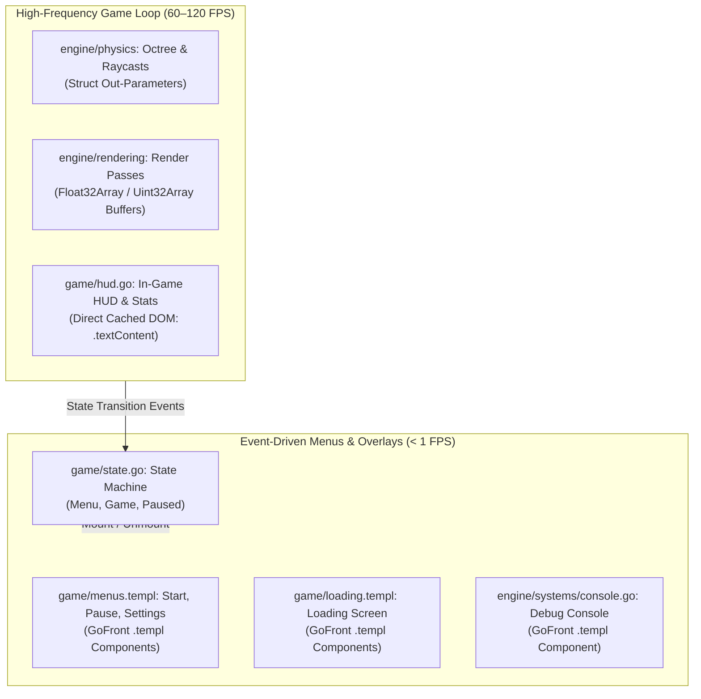
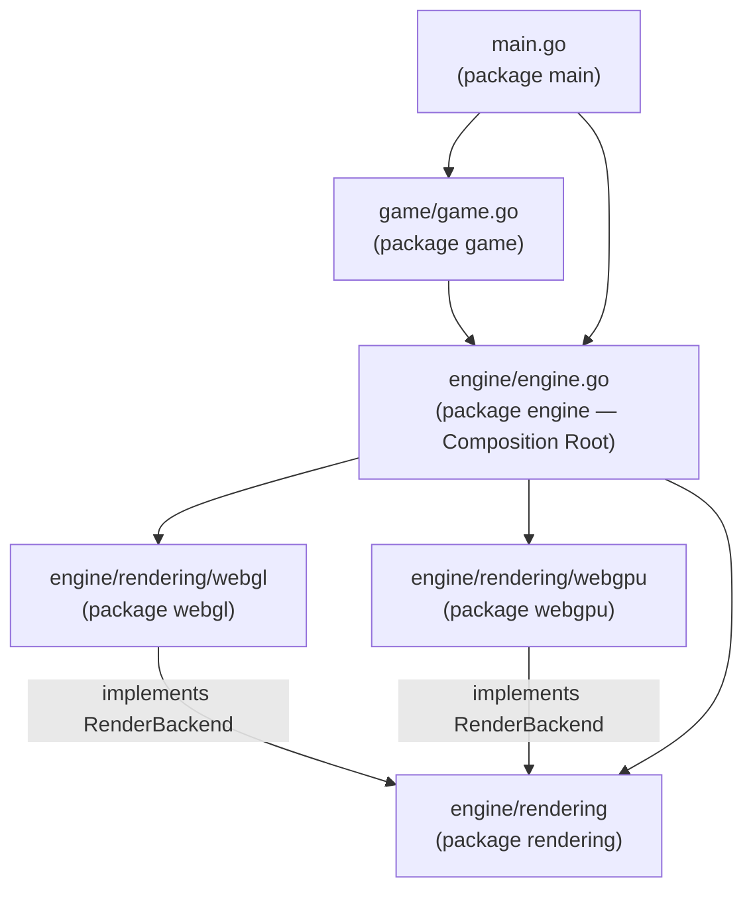

# GoFront Engine & Architecture Rewrite — Design Plan

**Version:** v2.1.0  
**Target Toolchain:** GoFront v1.3.8 (unreleased; `main` past tag `1.3.7`)  
**Status:** In Progress — Phase 1–8 complete on branch `gofront`  

---

## Toolchain Note

The port requires GoFront **1.3.8 or later** — i.e. the current `main` of the
`gofront` repo, which is five commits past the published `1.3.7`. Fixes surfaced
by this port and needed to compile it:

1. Pointer receivers are typed `*T` (previously `T`), so `return out` from a
   `func (out *Vec3) …` method type-checks and does not clone.
2. Omitted struct-typed fields of an *imported* struct type are zero-initialised
   (`new V()`) instead of `null`.
3. `&pkg.T{}` / `var v pkg.T` / `v := pkg.T{}` for imported struct types emit
   `new T()` and are typed `T` (not `any`), so `&v` is not boxed.
4. `sort.Slice`/`SliceStable`/`SliceIsSorted` use Go index semantics.
5. `rand.Float32` is typed `float32`; multi-assign with blanks and comma-ok
   assertions emit unique temporaries; `f().(T)` evaluates `f()` once.
6. Generic instantiation vs. index expression disambiguation (`xs[d.Field]`),
   and `[]pkg.T{...}` composite literals as call arguments.

Until 1.3.8 is published, `node_modules/gofront` must be an `npm link` to the
local checkout; `npm install` replaces the link with registry 1.3.7 (symptom:
`skeleton.go "Cannot assign [][]float32"` or a `RenderBackend not implemented`
overlay) — re-run `npm link gofront` afterwards.

`gofront test --dom` (used by `npm run test:dom`) needs the `jsdom` devDependency.

## Branch State (`gofront`)

- `app/src/engine/physics/`, `app/src/engine/systems/`, and `app/src/game/` are Go packages with
  unit and integration tests (`gofront test`, headless and `--dom`).
- Mobile virtual controls are ported to `.templ` (`app/src/engine/systems/virtual_input.templ`).
- In-game HUD, state machine, menus, loading screens, and debug console are ported to GoFront
  (`.go` and `.templ` components) eliminating all `Reactive.js` dependencies.
- All CSS lives in one plain stylesheet, `app/style.css` (base, menus, HUD, loading, console, stats,
  virtual input sections), linked from `app/index.html` so `gofront dev` hot-swaps it without
  a reload; `.templ` files contain markup only.
- `app/src/engine/rendering/` (+ `webgl/`, `webgpu/`) and `app/src/engine/engine.go` are ported:
  backend interface, resources, shaders, buffer allocation, full pass orchestration
  (`Renderer.Render`), and backend selection with WebGPU → WebGL2 fallback.
- `app/src/engine/animation/` (skeleton, clips, player) and `app/src/engine/scene/` (entities,
  scene container, light grid, all `SceneSource` passes) are ported with unit tests against a
  recording mock backend.
- `app/src/engine/assets/` (mesh/material/resource-list parsing, `ResourceManager`) and
  `app/src/game/` (player state, weapons, projectiles, pickups, arena, controls, update manager,
  `Game` fixed-step loop) are ported with headless and `--dom` tests. `NewGame` constructs the
  `Scene` and sets `engine.ActiveScene`.
- P2P multiplayer is ported: `systems.Network` wraps the vendored PeerJS (typed by
  `app/src/dependencies/peerjs.d.ts`), and `game.Multiplayer`/`RemotePlayer` handle host state
  broadcast, client position upload and remote easing, with fake-peer tests (headless and `--dom`).
- `app/src/main.go` (package `main`) boots the app: `engine.SelectBackend` → `ResourceManager`
  → `NewGame`, wires the menus/HUD/console and the render loop. All legacy `.js` modules under
  `app/src/` are deleted; the app is 100% Go/`.templ` compiled by `gofront dev` / `gofront build`.
- Phase 8 is done: `tests/perf/zero-alloc.js` (`npm run test:perf`) compiles the `physics` package
  with the GoFront compiler API and asserts a 100k-raycast sweep stays under 64 KB of new-space
  growth; `tests/e2e/smoke.spec.js` (`npm run test:e2e`, Playwright, WebGL2 in headless Chromium)
  asserts the compiled app boots to the menu without errors and renders a lit frame after start.
  `npm run test:all` runs check, unit, `--dom`, perf and E2E.

---

## Goal

Rewrite SimpleFPS from vanilla ES6 and Microtastic into a 100% type-safe, compiled GoFront architecture with zero-allocation hot paths, native WebGL2/WebGPU buffer manipulation, and native GoFront UI components.

The rewrite will **preserve the exact current folder structure and modular layout** (`app/src/engine/` and `app/src/game/`). All modules map 1-to-1 from `.js` to `.go` (and `.templ` for UI components). By leveraging GoFront v1.3.2 features (zero-allocation loops, TypedArrays, struct pointer unboxing, native `.templ` components, root test auto-detection, multi-file package type checking, and dual-directory dev watching), we eliminate runtime type ambiguity, replace `Reactive.js` with native GoFront patterns, remove `gl-matrix` and Microtastic dependencies, and deliver rock-solid 120+ FPS execution with 0 bytes allocated per frame in the game loop.

---

## Out of Scope

- **Altering the Folder Structure:** No artificial `pkg/` or Go-idiomatic monorepo restructuring. The directory hierarchy mirrors the existing SimpleFPS codebase directly.
- **Rewriting WebRTC/PeerJS from Scratch:** `peerjs` remains an external vendor dependency bundled via GoFront's built-in vendor bundler (`gofront prep` / `gofront build`) into `app/vendor.js` and typed via `js:../dependencies/peerjs.d.ts`.
- **Game Design & Content Changes:** All 3D assets (GLTF/GLB/OBJ meshes, textures, audio, arena layouts) and shader programs (GLSL for WebGL2, WGSL for WebGPU) remain identical.
- **Dedicated Game Servers:** The architecture remains strictly client-side Peer-to-Peer (P2P) with no backend infrastructure.

---

## Target Project & Folder Layout

The GoFront codebase preserves the current file and directory structure 1-to-1:

```
app/
├── index.html                        # App shell & canvas mount
├── style.css                         # Single plain stylesheet (hot-reloaded by gofront dev)
├── vendor.js                         # Bundled peerjs (gofront prep/build; gitignored)
└── src/
    ├── main.go                       # package main (application entry point)
    ├── interop.d.ts                  # Browser globals GoFront does not predeclare
    ├── dependencies/
    │   └── peerjs.d.ts               # P2P multiplayer type definitions
    ├── engine/                       # package engine (facade & composition root)
    │   ├── engine.go
    │   ├── animation/                # package animation
    │   │   ├── animation.go
    │   │   ├── animationplayer.go
    │   │   └── skeleton.go
    │   ├── physics/                  # package physics (zero-alloc math & collision)
    │   │   ├── vec3.go
    │   │   ├── mat4.go
    │   │   ├── quat.go
    │   │   ├── transform.go
    │   │   ├── ray.go
    │   │   ├── boundingbox.go
    │   │   ├── trimesh.go
    │   │   ├── octree.go
    │   │   ├── dynamicbody.go
    │   │   └── fpscontroller.go
    │   ├── rendering/                # package rendering (pipeline, mesh, shaders)
    │   │   ├── backend.go
    │   │   ├── renderbackend.go
    │   │   ├── renderer.go
    │   │   ├── renderpasses.go
    │   │   ├── mesh.go
    │   │   ├── skinnedmesh.go
    │   │   ├── material.go
    │   │   ├── texture.go
    │   │   ├── shaders.go
    │   │   ├── shapes.go
    │   │   ├── webgl/                # package webgl (WebGL2 backend implementation)
    │   │   │   ├── glsl.go
    │   │   │   └── webglbackend.go
    │   │   └── webgpu/               # package webgpu (WebGPU backend implementation)
    │   │       ├── wgsl.go
    │   │       └── webgpubackend.go
    │   ├── scene/                    # package scene (scene graph & entities)
    │   │   ├── entity.go
    │   │   ├── scene.go
    │   │   ├── lightgrid.go
    │   │   ├── meshentity.go
    │   │   ├── skinnedmeshentity.go
    │   │   ├── fpsmeshentity.go
    │   │   ├── pointlightentity.go
    │   │   ├── spotlightentity.go
    │   │   ├── directionallightentity.go
    │   │   ├── skyboxentity.go
    │   │   ├── particleemitterentity.go
    │   │   └── animatedbillboardentity.go
    │   └── systems/                  # package systems (camera, input, sound, etc.)
    │       ├── camera.go
    │       ├── input.go
    │       ├── sound.go
    │       ├── stats.go
    │       ├── console.go
    │       ├── network.go
    │       ├── resources.go
    │       ├── settings.go
    │       └── binaryreader.go
    └── game/                         # package game (gameplay logic, state & UI)
        ├── game.go
        ├── state.go                  # State machine (replaces Reactive.js signals)
        ├── gamedefs.go
        ├── translations.go
        ├── arena.go
        ├── controls.go
        ├── update.go
        ├── weapons.go
        ├── projectiles.go
        ├── pickups.go
        ├── player.go
        ├── remoteplayer.go
        ├── multiplayer.go
        ├── netvalidation.go
        ├── ui.go
        ├── hud.go                    # High-frequency cached DOM HUD
        ├── hud.templ                 # Initial HUD markup template
        ├── menus.templ               # Native GoFront templ menus
        └── loading.templ             # Native GoFront templ loading screen
```

---

## Architectural Decisions

### 1. In-Engine 3D Math (`app/src/engine/physics/`) vs `gl-matrix`

#### Decision
Implement vector, matrix, and quaternion math directly in `engine/physics/` (`vec3.go`, `mat4.go`, `quat.go`).

#### Rationale
In JavaScript, `gl-matrix` operates on flat arrays (`Float32Array`). In GoFront (utilizing v1.3.0 positional constructors and unboxed struct pointers), native structs offer superior ergonomics, strict static typing, and guaranteed zero allocations when using in-place out-parameters:

```go
// app/src/engine/physics/vec3.go
package physics

type Vec3 struct {
    X, Y, Z float32
}

func (out *Vec3) Add(a, b *Vec3) *Vec3 {
    out.X = a.X + b.X
    out.Y = a.Y + b.Y
    out.Z = a.Z + b.Z
    return out
}

func (out *Vec3) Cross(a, b *Vec3) *Vec3 {
    ax, ay, az := a.X, a.Y, a.Z
    bx, by, bz := b.X, b.Y, b.Z
    out.X = ay*bz - az*by
    out.Y = az*bx - ax*bz
    out.Z = ax*by - ay*bx
    return out
}
```

* Matrices (`Mat4`) use `[]float32` backed directly by `Float32Array` memory (allocated via `make([]float32, 16)`) for zero-allocation uniform buffer uploads via `gl.UniformMatrix4fv` / `gl.uniformMatrix4fv`.
* Quaternions (`Quat`) use `{ X, Y, Z, W float32 }`.
* Scratch instances (`var tmpVec = Vec3{}`) are pre-allocated per file for scratch calculations.

---

### 2. UI, HUD & State Architecture: Completely Eliminating `Reactive.js`

SimpleFPS currently uses `Reactive.js` in 9 files. We replace it using a two-tier strategy directly within `app/src/game/`:



#### A. In-Game HUD & Stats (`game/hud.go` — 60–120 FPS)
Reactivity libraries (signals, VDOM) introduce unnecessary function overhead when updating counters 120 times per second. 
We use **direct cached DOM element references** with dirty checks:
```go
// app/src/game/hud.go
package game

type HUD struct {
    healthEl Element
    armorEl  Element
    ammoEl   Element
    lastHP   int
    lastAmmo int
}

func (h *HUD) Update(hp, ammo int) {
    if hp != h.lastHP {
        h.healthEl.textContent = strconv.Itoa(hp)
        h.lastHP = hp
    }
    if ammo != h.lastAmmo {
        h.ammoEl.textContent = strconv.Itoa(ammo)
        h.lastAmmo = ammo
    }
}
```
* **Performance:** Executes in <0.01ms per frame with **0 bytes allocated**.

#### B. Menus, Loading, and Debug Console (Event-Driven: < 1 FPS)
Menus mount once and respond to click events. We author them using native GoFront **`.templ` files**:
```go
// app/src/game/menus.templ
package game

templ MainMenu(onStart func(), onSettings func()) {
    <div id="main-menu" class="menu-overlay">
        <h1 class="game-title">SimpleFPS</h1>
        <button class="btn primary" onclick={ onStart }>PLAY</button>
        <button class="btn" onclick={ onSettings }>SETTINGS</button>
    </div>
}
```

#### C. Game State Machine (`game/state.go`)
Replace `Signals.create("MENU")` with an idiomatic Go state machine:
```go
// app/src/game/state.go
package game

type GameState int
const (
    StateMenu GameState = iota
    StateGame
    StatePaused
)

type StateManager struct {
    Current   GameState
    listeners []func(GameState)
}

func (s *StateManager) Transition(next GameState) {
    if s.Current != next {
        s.Current = next
        for _, fn := range s.listeners { fn(next) }
    }
}
```

---

### 3. Rendering Pipeline & Native GPU Buffers (`engine/rendering/`)

#### Direct TypedArray Integration
* Vertex and Index Buffers use GoFront native TypedArrays (`[]float32`, `[]uint16`, `[]uint32`).
* When passing vertex data to GPU backends, `gl.BufferData(gl.ARRAY_BUFFER, mesh.Vertices, gl.STATIC_DRAW)` passes contiguous C++ memory directly to WebGL/WebGPU without conversion.
* Sub-slice windowing (`mesh.Vertices[offset:end]`) emits `.subarray()`, allowing multi-mesh batching with zero copies.
* Standard library WebGL2 and WebGPU typings (`WebGL2RenderingContext`, `GPUDevice`, `GPUQueue`) are available natively in GoFront without external `.d.ts` shims.

#### Dual Backend Abstraction & Dependency Direction (Acyclic DAG)
In vanilla SimpleFPS, `backend.js` imported `webglbackend.js`, while `webglbackend.js` imported `renderbackend.js` from `../renderbackend.js`. In GoFront's multi-file compiled package model, cyclic package imports are strictly disallowed.

To maintain a clean Directed Acyclic Graph (DAG):
1. `app/src/engine/rendering/` (`package rendering`) defines the common `RenderBackend` interface, render passes, mesh definitions, material types, and shader management.
2. `app/src/engine/rendering/webgl/` (`package webgl`) and `app/src/engine/rendering/webgpu/` (`package webgpu`) import `../` (`engine/rendering`) and implement `RenderBackend`.
3. `engine/rendering` **never** imports `webgl` or `webgpu`.
4. `app/src/engine/engine.go` (`package engine`) serves as the engine facade and composition root. It imports `engine/rendering`, `engine/rendering/webgl`, and `engine/rendering/webgpu`, selects the backend (WebGPU if available and enabled, otherwise WebGL2), and passes the active backend instance into `renderer.NewRenderer(backend)`.



---

### 4. Physics Engine & Collision Detection (`engine/physics/`)

* Port the Quake-style kinematic character controller (`fpscontroller.go`), AABB swept collisions, raycasts, and triangle meshes (`trimesh.go`, `octree.go`).
* All raycast and sweep queries take pre-allocated output pointers:
  ```go
  func (oct *Octree) Raycast(ray *Ray, maxDist float32, out *RayHit) bool
  func (body *DynamicBody) Sweep(delta *Vec3, out *SweepResult) bool
  ```
* Ensures full spatial partitioning queries run at 120 Hz fixed timesteps with zero heap churn.

---

### 5. GoFront 1.3.2 Build Tooling, CLI & Configuration

#### A. Zero-Config Project Layout Auto-Detection
GoFront 1.3.2 natively identifies the SimpleFPS project layout:
* **Source root (`srcDir`)**: Automatically resolves to `app/src` (compiled into `app/app.js` during dev, or `public/app.js` during build).
* **Server root (`serveDir`)**: Automatically resolves to `app` (serves `app/index.html` and static assets).
* **Release output (`outDir`)**: Defaults to `public`.

#### B. Dual-Directory Live Watching in `gofront dev` (v1.3.2)
* GoFront 1.3.2 monitors `app/src/` for `.go` and `.templ` source changes, running incremental re-compiles with fast sub-100ms rebuilds and live-reloads via SSE.
* In addition, `handleDev` in GoFront 1.3.2 watches `serveDir` (`app/`) for `.css` (injecting CSS hot updates without losing game state or page refresh) and `index.html` (triggering full page reload).
* Compile errors trigger the in-browser interactive error overlay with exact source carets while preserving dev server uptime.

#### C. Multi-File Package Type Checking (`gofront check`)
GoFront 1.3.2 fixed package directory symbol resolution (`resolveSrcDir`), verifying that package directories containing multiple `.go`/`.templ` files compile as a unified package rather than collapsing to single-file `main.go`. This enables `gofront check` across all package subtrees.

#### D. Built-in Vendor Bundler with Node Polyfills (`peerjs`)
SimpleFPS bundles `peerjs` for P2P networking. GoFront's built-in bundler (`gofront prep` / `gofront build`) packages external dependencies with Rolldown or esbuild. GoFront automatically detects and applies `@rolldown/plugin-node-polyfills` to provide necessary Node built-in shims for WebRTC/PeerJS.

```json
{
  "name": "simplefps",
  "private": true,
  "type": "module",
  "scripts": {
    "dev": "gofront dev",
    "build": "gofront build --pwa",
    "check": "biome check . && gofront check app/src/...",
    "test": "gofront test app/src/...",
    "test:dom": "gofront test --dom app/src/...",
    "test:perf": "node tests/perf/zero-alloc.js",
    "test:e2e": "playwright test",
    "test:all": "npm run check && npm test && npm run test:dom && npm run test:perf && npm run test:e2e",
    "format": "biome format --write ."
  },
  "dependencies": {
    "peerjs": "^1.5.5"
  },
  "devDependencies": {
    "@biomejs/biome": "^2.5.14",
    "@playwright/test": "^1.63.0",
    "gofront": "^1.3.8",
    "jsdom": "^30.1.1",
    "lefthook": "^2.1.14",
    "rolldown": "^1.2.7"
  },
  "vendor": {
    "dest": [
      "app/vendor.js",
      "public/vendor.js"
    ],
    "packages": ["peerjs"],
    "globals": {
      "peerjs": "Peer"
    }
  }
}
```

#### E. Offline PWA Support (`gofront build --pwa`)
SimpleFPS already contains `app/manifest.json` and 192x192 / 512x512 icons. Running `gofront build --pwa` automatically generates `public/sw.js` with pre-cached game assets and registers the service worker in `index.html`.

---

## Phased Implementation Plan

```mermaid
gantt
    title SimpleFPS GoFront Rewrite Timeline
    dateFormat  X
    axisFormat %d

    section Phase 1: Foundation
    GoFront 1.3.2 Toolchain & Scaffolding   :p0, 0, 2
    engine/physics Math (vec3, mat4, quat) :p1, after p0, 3

    section Phase 2: Core Physics & State
    engine/physics (octree, fpscontroller) :p3, after p1, 4
    game/state & engine/systems            :p4, after p0, 3

    section Phase 3: UI & HUD
    game/menus.templ & loading.templ       :p5, after p4, 3
    game/hud.go Direct DOM Updating        :p6, after p5, 2

    section Phase 4: Rendering
    engine/rendering Pipeline & Shaders    :p7a, after p3, 3
    engine/rendering/webgl & webgpu        :p7b, after p7a, 4

    section Phase 5: Scene & Gameplay
    engine/scene & animation               :p9, after p7b, 4
    game/ weapons, arena, player           :p10, after p9, 4

    section Phase 6: Networking & Polish
    game/multiplayer (PeerJS Vendor Bundle):p11, after p10, 3
    Zero-Allocation Profiling & E2E        :p12, after p11, 3
```



### Phase 1: Foundation, Math & Toolchain Configuration (`app/src/engine/physics/`) — Done
1. Configure `package.json` with GoFront scripts (`gofront dev`, `gofront build`, `gofront test`, `gofront check`).
2. Remove legacy `microtastic` and `gl-matrix` dependencies.
3. Configure `vendor` bundling for `peerjs`.
4. Implement `vec3.go`, `mat4.go`, `quat.go` in `package physics`.
5. Add unit tests (`vec3_test.go`, `mat4_test.go`) verified via `gofront test app/src/engine/physics`.

### Phase 2: Core Physics & Systems (`app/src/engine/physics/`, `engine/systems/`) — Done
1. Port `boundingbox.go`, `ray.go`, `trimesh.go`, `octree.go`, `dynamicbody.go` into `package physics`.
   Octree queries write into caller-provided `[]int` buffers and return a count; frustum planes are a flat `[]float32` of 24.
2. Port `fpscontroller.go` (fixed 120 Hz timestep, Quake-style step-climbing, wall sliding).
3. Port `camera.go`, `input.go`, `settings.go`, `binaryreader.go`, `sound.go` into `package systems`.
4. `integration_test.go` covers subdivided-octree queries, trimesh raycasts, controller landing / wall blocking / step climbing, and a heap-growth guard for the physics step.

### Phase 3: UI Overhaul & Eliminating `Reactive.js` (`app/src/game/`, `engine/systems/`) — Done
1. Implemented `game/state.go` state machine in `package game` replacing Reactive.js signals.
2. Built `game/menus.templ`, `game/loading.templ`, `engine/systems/console.templ`, and `engine/systems/virtual_input.templ`.
3. Built zero-allocation cached DOM HUD in `game/hud.go` and `game/hud.templ`.
4. Ported `game/ui.go` and `game/translations.go`, wiring up menus, settings tabs, and modal dialogs.
5. Ported `engine/systems/console.go`, providing debug command execution and history.
6. Ported mobile touch controls into `engine/systems/input.go` (look pad, joystick-to-keys mapping, shoot/jump buttons dispatching `game:shoot` / `game:jump`) with markup in `virtual_input.templ`.
7. Ported the debug stats overlay to `engine/systems/stats.go` + `stats.templ` (cached DOM, once-per-second text writes); `engine.go` mounts it, feeds `rendering.ActiveRenderStats`, and registers the `stats` console command.
8. Removed `reactive.js` dependencies and verified complete test coverage across `app/src/game` and `app/src/engine/systems` in both headless and DOM environments.
9. Moved all CSS out of `.templ`/`gom.Style`/inline `index.html` into a single `app/style.css`, linked from `index.html`, so the dev server's CSS hot-reload (§5B) applies and the stylesheet ships as a static asset in `gofront build`.

### Phase 4: Rendering Pipeline & Backends (`app/src/engine/rendering/`, `webgl/`, `webgpu/`, `engine.go`) — Done

1. Defined abstract `RenderBackend` interface in `package rendering` (`renderbackend.go`) covering textures, framebuffers, uniform buffer objects (UBOs), vertex array objects (VAOs), pipeline states, and drawing commands.
2. Ported shader catalog (`shaders.go`), shapes generator (`shapes.go`), mesh geometry buffers (`mesh.go`, `skinnedmesh.go`), material system (`material.go`, std140 byte layout), texture management (`texture.go`), render-buffer allocation and FrameData UBO (`renderer.go`), and the full pass orchestration in `renderpasses.go`: geometry, FPS geometry, shadow (with Kawase blur, skipped without casters), lighting (with `LightSorter` and `LightingData` UBO), transparent, billboards, emissive blur, post-processing, FSR EASU/RCAS, and debug stages. `Renderer.Render` drives the frame through a `SceneSource` interface so `rendering` stays independent of the future `scene` package.
3. Decoupled `package rendering` completely from `systems.Camera`, using a clean `CameraView` struct and matrix slices.
4. WebGL2 backend (`package webgl` in `app/src/engine/rendering/webgl/`):
   - Inlined all 16 GLSL shader sources in `glsl.go`.
   - Ported resource creation, state caching, UBOs, VAOs, and draw calls in `webglbackend.go`; honours `RenderScale`/`DoFSR` from settings.
   - Unit tests in `webgl_test.go` cover construction, shader catalog wiring, state defaults, and that every pass uniform exists in the GLSL sources.
5. WebGPU backend (`package webgpu` in `app/src/engine/rendering/webgpu/`):
   - Inlined all 16 WGSL shader sources and bind group layouts in `wgsl.go`.
   - Ported pipelines, bind groups, vertex/index buffers, and render passes in `webgpubackend.go`. Adapter/device acquisition is asynchronous; `Init` reports success/failure via callback and the engine awaits it before falling back.
   - Unit tests in `webgpu_test.go` cover construction, shader catalog wiring, state tracking, headless init failure, format support, and struct-packing buffer reuse.
6. Enforced strict Directed Acyclic Graph (DAG) architecture: `webgl` and `webgpu` import `rendering`; `rendering` never imports `webgl` or `webgpu`.
7. Composition root in `app/src/engine/engine.go` selects the backend asynchronously (preferring WebGPU when supported and reported ready, falling back to WebGL2), syncs settings into the active backend, wires viewport resizing and lifecycle (`Init`, `Start`, `Pause`, `Dispose`), and invokes `Renderer.Render` each frame via `RenderFrame`.
8. `rendering` has a recording `MockBackend` (`mockbackend_test.go`) used to assert the exact stage order for WebGL and WebGPU, buffer-format resolution, Kawase odd-iteration copy-back, FrameData/Material UBO byte layouts, light sorting, and a heap-growth guard proving `Render` allocates nothing per frame.
9. Check and test suites pass across all packages (`npm run check && npm test && npm run test:dom`).

### Phase 5: Scene Graph & Entities (`app/src/engine/scene/`, `engine/animation/`) — Done

1. `package animation` (`skeleton.go`, `animation.go`, `animationplayer.go`): joint hierarchy with inverse bind matrices, `Pose` (flat position/rotation arrays), `GetWorldMatrices`/`ComputeSkinningMatrices` writing into pre-allocated `[]physics.Mat4`, binary clip parsing (`ParseBinaryAnimation`) with per-frame bounds, frame interpolation, and an `AnimationPlayer` (play/pause/stop/seek/loop/speed) that returns a reused `*Pose`.
2. `package scene` entities (`entity.go`, `meshentity.go`, `skinnedmeshentity.go`, `lightentities.go`, `skyboxentity.go`, `animatedbillboardentity.go`, `particleemitterentity.go`): an `Entity` interface plus a shared `EntityBase` struct. GoFront has no promoted fields, so entities use explicit composition (`e.Base`, `GetBase()`) instead of JS class inheritance. Entities never import `scene` internals — the scene passes probe colour, render mode and shader into `Render`, and sets `SkyboxEntity.CameraPosition` / `AnimatedBillboardEntity.CameraView` before drawing. Spot light `Angle` stays in degrees (cutoff = cos). Particle emitters render with `RenderBackend.DrawInstanced` and per-instance vertex attributes (`VertexAttribute.Divisor`), both added to the backend interface and both backends in this phase.
3. `Scene` (`scene.go`): fixed-capacity `entityList`s per type and a visible list per type (rebuilt with frustum culling in `UpdateVisibility`), swap-remove with deferred disposal, static geometry merging into one `physics.Trimesh` (world-space verts, double-sided flags for translucent/double-sided/alpha materials), and `Raycast`/`RaycastStatic`/`RaycastDynamic`. `NewScene` installs `physics.GlobalRaycastStatic` (as a closure — GoFront method values are not bound). `LightGrid` (`lightgrid.go`) does trilinear ambient lookup from a byte volume with the JS axis mapping (engine +Y → grid Z).
4. `Scene` implements `rendering.SceneSource` in `renderpasses.go`: world/FPS geometry (with `uProbeColor` probe sampling cached per frame), shadows (screen-size sorted, 16 static raycasts per frame budget, skinned re-sampling every 3 frames or on movement), lighting (sorted point/spot volumes, directional screen quad), transparent (back-to-front by clip w, `LightingData` UBO), billboards/particles, and debug (bounding boxes coloured per type, wireframes, light volumes, skeletons). `RegisterDebugCommands()` exposes `tbv`/`twf`/`tlv`/`tsk`.
5. Zero per-frame allocation: pre-sized score/sort lists, scratch matrices/vectors as package vars, single-value type assertions (emitted as `instanceof`), no `append`/tuple returns in passes. `scene_test.go` includes a heap-growth guard that runs 50 full frames and asserts buffer lengths are unchanged, alongside tests for entity lifecycle, culling, static raycasts, light grid sampling, and every render pass's shader/uniform/draw sequence.
6. Two GoFront fixes surfaced by this phase: generic instantiation parsed as index expressions (typechecker), and `[]pkg.Type{...}` composite literals as call arguments (parser).

### Phase 6: Gameplay Mechanics (`app/src/game/`, `engine/assets/`) — Done

1. `package assets` (`meshloader.go`, `materialloader.go`, `resources.go`): binary/JSON mesh parsing (`ParseBinaryMesh` v1/v2/v5-skinned → `BuildMesh`/`BuildSkinnedMesh`), material libraries with `base` inheritance, resource lists, and a `ResourceManager` (`Load`/`Fetch`/`Decode`, typed getters, dedupe, list cycle guard, `ResolveLinks` binding textures and material lookups to meshes and the skybox). `systems.BinaryReader` now copies bytes when a typed-array view would be unaligned.
2. `package game` (`gamedefs.go`, `player.go`, `weapons.go`, `projectiles.go`, `pickups.go`, `arena.go`, `controls.go`, `game.go`, `update.go`): weapon definitions/animation/switching/recoil, projectile `DynamicBody` lifecycle with explosion billboards and spark emitters, pickup spawn/collect/respawn with lights, arena config parsing (`ParseArenaConfig`) plus build (lighting, light grid, skybox, static chunks, pickups, NPC spawn models), DOM controls with gameplay-input guards, a service-worker `UpdateManager`, and `Game` (fixed 1/120 s physics step, HUD/loading wiring, `SpawnPlayer`).
3. Fixed-capacity active lists with swap-remove, scratch vectors as struct fields, and no per-frame allocation in `Update` paths. `gameplay_test.go` covers definitions, player clamping, weapon load/select/switch/shoot cooldown, projectile lifecycle, pickup collect/respawn, arena parsing/build/missing-map load, game spawn/update, control guards and the update manager (headless and `--dom`).
4. Two GoFront fixes surfaced by this phase: `rand.Float32` typed as `float64` (typechecker), and multi-assign with blanks / comma-ok assertions re-declaring `let __t` in the same scope (codegen now emits unique `const __tN`).

### Phase 7: P2P Multiplayer (`app/src/game/multiplayer.go`) — Done

1. `app/src/dependencies/peerjs.d.ts` declares `PeerClient`/`PeerDataConnection` interfaces for the vendored PeerJS bundle (`window.Peer`, bundled via `gofront prep`/`gofront build`).
2. `systems.Network` (`engine/systems/network.go`): host/client roles, async `Host()`/`Connect()` with timeout, client list with fixed capacity, reused `POS`/`STATE` packets, injectable `PeerFactory` so tests use fake peers/connections (no WebRTC in tests).
3. `package game`: `netvalidation.go` (`IsVec3`, `Vec3FromAny`, `Vec3ToArray`), `remoteplayer.go` (eased mesh entity per remote peer), `multiplayer.go` (host state broadcast at 30 Hz, client position upload, stamp-based add/retarget/remove of remotes, `host`/`join` console commands). `Game` owns a `Multiplayer` and ticks it every frame, including while menus are open.
4. Tests: `network_test.go` (systems) and `multiplayer_test.go` (game) cover host/client flows, failures, state application and remote easing. GoFront fix surfaced: `v := pkg.T{}` composite literals with a qualified type were typed `any`, so `&v` was boxed; `resolveTypeNode` now resolves `SelectorExpr` type nodes.

### Phase 8: Verification & Optimization — Done
1. `gofront test` passes across all package suites (headless and `--dom`); `gofront build --pwa` produces the offline bundle.
2. Playwright smoke suite (`tests/e2e/smoke.spec.js`): boot to menu on WebGL2 with no page errors, start game → HUD + populated scene + non-black frame. Full gameplay E2E (movement/shooting/collision) was prototyped and deliberately dropped as not needed at this stage.
3. Zero-allocation benchmark (`tests/perf/zero-alloc.js`): 100k `IntersectTrimesh` raycasts against a 2048-triangle mesh, best of five sweeps; new-space delta < 64 KB (measured ≈3 KB). Surfaced and fixed a real per-cast allocation: a `float32` distance passed into the `ReportIntersection`/`RaycastResult.Set` helpers was boxed as a HeapNumber by V8 whenever the callee was not inlined (which varied run to run), so hit recording now writes `Ray.Result` fields directly.
4. Runtime fixes found while booting the full app: WebGPU `createShaderModule` must receive a `label` for the bind-group lookup (`wgslLabelFor`), texture recreation on image upload, mip levels and depth compare state; lightmap vertex attribute binding in `mesh.go`.

---

## Test Plan

### Unit Tests (`gofront test`)
* **Recursive package patterns:** `gofront test app/src/...` and `gofront check app/src/...` cover every package under `app/src` (including `main`), so `package.json` no longer lists packages by hand.
* **Project Root Auto-Detection (v1.3.2):** Running `gofront test` from project root automatically detects `app/src`.
* **Package Suites:**
  * `gofront test app/src/engine/physics`: Vector/matrix math accuracy, normalization, quaternion slerp, octree raycast hits, sliding plane calculations.
  * `gofront test app/src/game`: State machine transitions, listener invocation, menu routing.
* **CLI Testing Flags:**
  * `-v`: Verbose output with per-test subtest timing.
  * `-run <regex>`: Filter tests by pattern.
  * `--dom`: Run tests inside simulated JSDOM environment for `.templ` and UI components.

### E2E Smoke Tests (Playwright)
* `npm run test:e2e` launches `gofront dev --port 3131` and headless Chromium (SwiftShader, WebGL2; settings seeded via `localStorage` with `UseWebGPU:false, ShowStats:true`).
* Boot → main menu visible, renderer reports `webgl2`, arena loaded, no page errors.
* Start game → HUD visible, scene stats populated, canvas screenshot is >5% lit.

### Zero-Allocation Benchmark
* `npm run test:perf` runs `tests/perf/zero-alloc.js`: compiles `app/src/engine/physics` via `compileDir`, warms up, then performs 5 × 100,000 raycasts.
* Asserts the best sweep's V8 new-space delta < 64 KB (measured ≈3 KB); run with `--max-semi-space-size=512 --expose-gc` when bisecting allocations.


