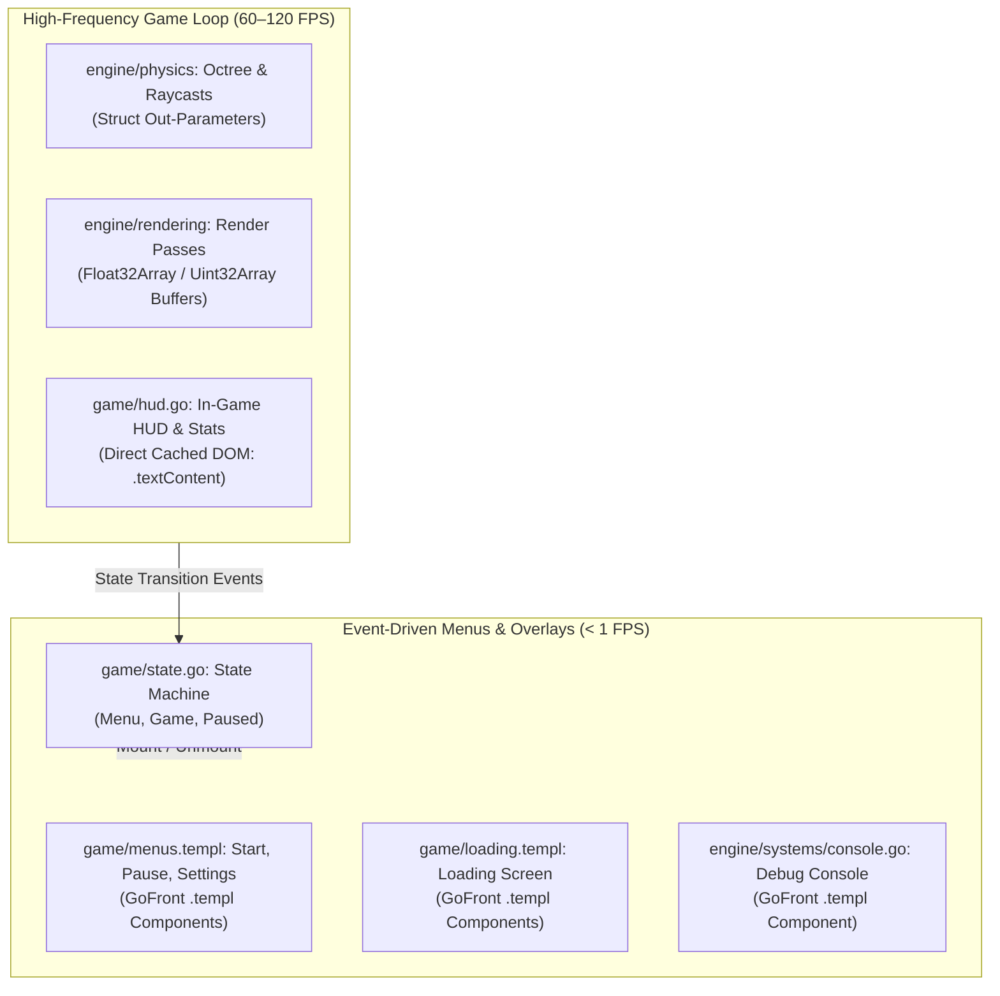

# GoFront Engine & Architecture Rewrite — Design Plan

**Version:** v2.0.0  
**Status:** Draft  

---

## Goal

Rewrite SimpleFPS from vanilla ES6 and Microtastic into a 100% type-safe, compiled GoFront architecture with zero-allocation hot paths, native WebGL2/WebGPU buffer manipulation, and native GoFront UI components.

The rewrite will **preserve the exact current folder structure and modular layout** (`app/src/engine/` and `app/src/game/`). All modules map 1-to-1 from `.js` to `.go` (and `.templ` for UI components). By leveraging GoFront v1.3.0 features (zero-allocation loops, TypedArrays, struct pointer unboxing, and `.templ` components), we eliminate runtime type ambiguity, replace `Reactive.js` with native GoFront patterns, remove `gl-matrix` and Microtastic dependencies, and deliver rock-solid 120+ FPS execution with 0 bytes allocated per frame in the game loop.

---

## Out of Scope

- **Altering the Folder Structure:** No artificial `pkg/` or Go-idiomatic monorepo restructuring. The directory hierarchy mirrors the existing SimpleFPS codebase directly.
- **Rewriting WebRTC/PeerJS from Scratch:** `peerjs` remains an external vendor dependency accessed through a typed GoFront wrapper (`js:./dependencies/peerjs.d.ts`).
- **Game Design & Content Changes:** All 3D assets (GLTF/GLB/OBJ meshes, textures, audio, arena layouts) and shader programs (GLSL for WebGL2, WGSL for WebGPU) remain identical.
- **Dedicated Game Servers:** The architecture remains strictly client-side Peer-to-Peer (P2P) with no backend infrastructure.

---

## Target Project & Folder Layout

The GoFront codebase preserves the current file and directory structure 1-to-1:

```
app/
├── index.html
└── src/
    ├── main.go                       # Application entry point
    ├── dependencies/
    │   ├── peerjs.d.ts               # P2P multiplayer type definitions
    │   └── peerjs.js                 # Bundled vendor dependency
    ├── engine/
    │   ├── engine.go                 # Engine facade and loop coordination
    │   ├── animation/
    │   │   ├── animation.go
    │   │   ├── animationplayer.go
    │   │   └── skeleton.go
    │   ├── physics/
    │   │   ├── vec3.go               # Native 3D vector math (replaces gl-matrix)
    │   │   ├── mat4.go               # Native 4x4 matrix math (replaces gl-matrix)
    │   │   ├── quat.go               # Native quaternion math (replaces gl-matrix)
    │   │   ├── transform.go
    │   │   ├── ray.go
    │   │   ├── boundingbox.go
    │   │   ├── trimesh.go
    │   │   ├── octree.go
    │   │   ├── dynamicbody.go
    │   │   └── fpscontroller.go
    │   ├── rendering/
    │   │   ├── backend.go
    │   │   ├── renderbackend.go
    │   │   ├── renderer.go
    │   │   ├── renderpasses.go
    │   │   ├── mesh.go
    │   │   ├── skinnedmesh.go
    │   │   ├── material.go
    │   │   ├── texture.go
    │   │   ├── shaders.go
    │   │   ├── shapes.go
    │   │   ├── webgl/
    │   │   │   ├── glsl.go
    │   │   │   └── webglbackend.go
    │   │   └── webgpu/
    │   │       ├── wgsl.go
    │   │       └── webgpubackend.go
    │   ├── scene/
    │   │   ├── entity.go
    │   │   ├── scene.go
    │   │   ├── lightgrid.go
    │   │   ├── meshentity.go
    │   │   ├── skinnedmeshentity.go
    │   │   ├── fpsmeshentity.go
    │   │   ├── pointlightentity.go
    │   │   ├── spotlightentity.go
    │   │   ├── directionallightentity.go
    │   │   ├── skyboxentity.go
    │   │   ├── particleemitterentity.go
    │   │   └── animatedbillboardentity.go
    │   └── systems/
    │       ├── camera.go
    │       ├── input.go
    │       ├── sound.go
    │       ├── stats.go
    │       ├── console.go
    │       ├── network.go
    │       ├── resources.go
    │       ├── settings.go
    │       └── binaryreader.go
    └── game/
        ├── game.go
        ├── state.go                  # State machine (replaces Reactive.js signals)
        ├── gamedefs.go
        ├── translations.go
        ├── arena.go
        ├── controls.go
        ├── update.go
        ├── weapons.go
        ├── projectiles.go
        ├── pickups.go
        ├── player.go
        ├── remoteplayer.go
        ├── multiplayer.go
        ├── netvalidation.go
        ├── ui.go
        ├── hud.go                    # High-frequency cached DOM HUD
        ├── hud.templ                 # Initial HUD markup template
        ├── menus.templ               # Native GoFront templ menus
        └── loading.templ             # Native GoFront templ loading screen
```

---

## Architectural Decisions

### 1. In-Engine 3D Math (`app/src/engine/physics/`) vs `gl-matrix`

#### Decision
Implement vector, matrix, and quaternion math directly in `engine/physics/` (`vec3.go`, `mat4.go`, `quat.go`).

#### Rationale
In JavaScript, `gl-matrix` operates on flat arrays (`Float32Array`). In GoFront (utilizing v1.3.0 positional constructors and unboxed struct pointers), native structs offer superior ergonomics, strict static typing, and guaranteed zero allocations when using in-place out-parameters:

```go
// app/src/engine/physics/vec3.go
package physics

type Vec3 struct {
    X, Y, Z float32
}

func (out *Vec3) Add(a, b *Vec3) *Vec3 {
    out.X = a.X + b.X
    out.Y = a.Y + b.Y
    out.Z = a.Z + b.Z
    return out
}

func (out *Vec3) Cross(a, b *Vec3) *Vec3 {
    ax, ay, az := a.X, a.Y, a.Z
    bx, by, bz := b.X, b.Y, b.Z
    out.X = ay*bz - az*by
    out.Y = az*bx - ax*bz
    out.Z = ax*by - ay*bx
    return out
}
```

* Matrices (`Mat4`) use `[16]float32` backed directly by `Float32Array` memory for uniform buffer uploads.
* Quaternions (`Quat`) use `{ X, Y, Z, W float32 }`.
* Scratch instances (`var tmpVec = Vec3{}`) are pre-allocated per file for scratch calculations.

---

### 2. UI, HUD & State Architecture: Completely Eliminating `Reactive.js`

SimpleFPS currently uses `Reactive.js` in 9 files. We replace it using a two-tier strategy directly within `app/src/game/`:



#### A. In-Game HUD & Stats (`game/hud.go` — 60–120 FPS)
Reactivity libraries (signals, VDOM) introduce unnecessary function overhead when updating counters 120 times per second. 
We use **direct cached DOM element references** with dirty checks:
```go
// app/src/game/hud.go
package game

type HUD struct {
    healthEl Element
    armorEl  Element
    ammoEl   Element
    lastHP   int
    lastAmmo int
}

func (h *HUD) Update(hp, ammo int) {
    if hp != h.lastHP {
        h.healthEl.textContent = strconv.Itoa(hp)
        h.lastHP = hp
    }
    if ammo != h.lastAmmo {
        h.ammoEl.textContent = strconv.Itoa(ammo)
        h.lastAmmo = ammo
    }
}
```
* **Performance:** Executes in <0.01ms per frame with **0 bytes allocated**.

#### B. Menus, Loading, and Debug Console (Event-Driven: < 1 FPS)
Menus mount once and respond to click events. We author them using native GoFront **`.templ` files**:
```go
// app/src/game/menus.templ
package game

templ MainMenu(onStart func(), onSettings func()) {
    <div id="main-menu" class="menu-overlay">
        <h1 class="game-title">SimpleFPS</h1>
        <button class="btn primary" onclick={ onStart }>PLAY</button>
        <button class="btn" onclick={ onSettings }>SETTINGS</button>
    </div>
}
```

#### C. Game State Machine (`game/state.go`)
Replace `Signals.create("MENU")` with an idiomatic Go state machine:
```go
// app/src/game/state.go
package game

type GameState int
const (
    StateMenu GameState = iota
    StateGame
    StatePaused
)

type StateManager struct {
    Current   GameState
    listeners []func(GameState)
}

func (s *StateManager) Transition(next GameState) {
    if s.Current != next {
        s.Current = next
        for _, fn := range s.listeners { fn(next) }
    }
}
```

---

### 3. Rendering Pipeline & Native GPU Buffers (`engine/rendering/`)

#### Direct TypedArray Integration
* Vertex and Index Buffers use GoFront v1.3.0 native TypedArrays (`[]float32`, `[]uint16`, `[]uint32`).
* When passing vertex data to GPU backends, `gl.BufferData(gl.ARRAY_BUFFER, mesh.Vertices, gl.STATIC_DRAW)` passes contiguous C++ memory directly to WebGL/WebGPU without conversion.
* Sub-slice windowing (`mesh.Vertices[offset:end]`) emits `.subarray()`, allowing multi-mesh batching with zero copies.

#### Dual Backend Abstraction
* `engine/rendering/backend.go`: Defines the common `RenderBackend` interface.
* `engine/rendering/webgl/webglbackend.go`: Uses GoFront static `WebGL2RenderingContext` bindings with GLSL shaders.
* `engine/rendering/webgpu/webgpubackend.go`: Uses GoFront static `GPUDevice` / `GPUQueue` bindings with WGSL shaders.

---

### 4. Physics Engine & Collision Detection (`engine/physics/`)

* Port the Quake-style kinematic character controller (`fpscontroller.go`), AABB swept collisions, raycasts, and triangle meshes (`trimesh.go`, `octree.go`).
* All raycast and sweep queries take pre-allocated output pointers:
  ```go
  func (oct *Octree) Raycast(ray *Ray, maxDist float32, out *RayHit) bool
  func (body *DynamicBody) Sweep(delta *Vec3, out *SweepResult) bool
  ```
* Ensures full spatial partitioning queries run at 120 Hz fixed timesteps with zero heap churn.

---

## Phased Implementation Plan

```mermaid
gantt
    title SimpleFPS GoFront Rewrite Timeline
    dateFormat  X
    axisFormat %d

    section Phase 1: Foundation
    engine/physics Math (vec3, mat4, quat) :p1, 0, 3
    Build Tooling & Scaffolding            :p2, 1, 3

    section Phase 2: Core Physics & State
    engine/physics (octree, fpscontroller) :p3, after p1, 4
    game/state & engine/systems            :p4, after p2, 3

    section Phase 3: UI & HUD
    game/menus.templ & loading.templ       :p5, after p4, 3
    game/hud.go Direct DOM Updating        :p6, after p5, 2

    section Phase 4: Rendering
    engine/rendering/webgl                 :p7, after p3, 5
    engine/rendering/webgpu                :p8, after p7, 5

    section Phase 5: Scene & Gameplay
    engine/scene & animation               :p9, after p7, 4
    game/ weapons, arena, player           :p10, after p9, 4

    section Phase 6: Networking & Polish
    game/multiplayer (PeerJS)              :p11, after p10, 3
    Zero-Allocation Profiling & E2E        :p12, after p11, 3
```



### Phase 1: Foundation & Math (`app/src/engine/physics/`)
1. Configure project with `gofront dev` and `gofront build`.
2. Implement `vec3.go`, `mat4.go`, `quat.go` in `engine/physics/`.
3. Add unit tests verifying parity against `gl-matrix` output.

### Phase 2: Core Physics & Systems (`app/src/engine/physics/`, `engine/systems/`)
1. Port `boundingbox.go`, `ray.go`, `trimesh.go`, `octree.go`, `dynamicbody.go`.
2. Port `fpscontroller.go` (fixed 120 Hz timestep, Quake-style step-climbing, wall sliding).
3. Port `camera.go`, `input.go`, `settings.go`, `binaryreader.go`, `sound.go`.

### Phase 3: UI Overhaul & Eliminating `Reactive.js` (`app/src/game/`)
1. Implement `game/state.go` state machine.
2. Build `game/menus.templ`, `game/loading.templ`, and `engine/systems/console.templ`.
3. Build zero-allocation cached DOM HUD in `game/hud.go`.
4. Remove `reactive.js` from `dependencies/` and `package.json`.

### Phase 4: Rendering Backends (`app/src/engine/rendering/`)
1. Port `shaders.go`, `shapes.go`, `mesh.go`, `material.go`, `texture.go`.
2. Port `engine/rendering/webgl/` (`glsl.go`, `webglbackend.go`).
3. Port `engine/rendering/webgpu/` (`wgsl.go`, `webgpubackend.go`).
4. Port `renderpasses.go` and `renderer.go`.

### Phase 5: Scene Graph & Entities (`app/src/engine/scene/`, `engine/animation/`)
1. Port `entity.go`, `scene.go`, `lightgrid.go`, and light entities.
2. Port `meshentity.go`, `skinnedmeshentity.go`, `particleemitter.go`.
3. Port `skeleton.go`, `animation.go`, `animationplayer.go`.

### Phase 6: Gameplay Mechanics (`app/src/game/`)
1. Port `weapons.go` (weapons definition, firing, switching).
2. Port `projectiles.go`, `pickups.go`, `arena.go`, `player.go`, `update.go`.

### Phase 7: P2P Multiplayer (`app/src/game/multiplayer.go`)
1. Set up `dependencies/peerjs.d.ts`.
2. Port `netvalidation.go`, `multiplayer.go`, `remoteplayer.go` with snapshot interpolation.

### Phase 8: Verification & Optimization
1. Run Playwright E2E game verification suite (menu boot, player movement, shooting, collision).
2. Assert heap memory delta via `v8.getHeapSpaceStatistics()` during active combat loop equals **0 bytes**.

---

## Test Plan

### Unit Tests (`gofront test`)
* `engine/physics`: Vector/matrix math accuracy, normalization, quaternion slerp, inverse transforms.
* `engine/physics`: Octree raycast hit positions, AABB box intersection, sliding plane calculations.
* `game/state`: State machine transitions, listener invocation, menu routing.

### E2E Integration Tests (Playwright)
* Launch game in headless Chromium.
* Test menu navigation -> play transition -> HUD visibility.
* Simulate keyboard/mouse movement, shooting weapons, pickup collection.

### Zero-Allocation Benchmark
* Run 100,000 frame ticks in Node.js headless benchmark.
* Assert total allocated heap delta during active game loop is **0 bytes**.

