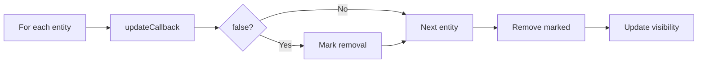

# Scene System Architecture

## Overview

The Scene system is SimpleFPS's **Entity-Component System** managing game objects, updates, and visibility culling.

## File Structure

```
app/src/engine/scene/
├── scene.js                  # Entity registry, update loop, visibility
├── entity.js                 # Base Entity class + EntityTypes
├── lightgrid.js              # Volumetric lighting grid
├── meshentity.js, skinnedmeshentity.js, fpsmeshentity.js
├── skyboxentity.js
└── directionallightentity.js, pointlightentity.js, spotlightentity.js
```

## Entity Types

```javascript
EntityTypes = {
    MESH: 1,                // World geometry
    FPS_MESH: 2,            // Weapon/hands
    DIRECTIONAL_LIGHT: 3,   // Sun/moon
    POINT_LIGHT: 4,         // Torch/lamp
    SPOT_LIGHT: 5,          // Flashlight
    SKYBOX: 6,              // Environment
    SKINNED_MESH: 7,        // Animated characters
};
```

## Base Entity Class

**Properties:**
- `type`, `visible`, `base_matrix`, `ani_matrix`
- `boundingBox` (for frustum culling)
- `updateCallback`, `animationTime`

**Lifecycle:**
```javascript
const entity = new MeshEntity([x,y,z], "model.mesh", updateCallback);
Scene.addEntities(entity);      // Add to scene
entity.update(deltaTime);        // Per-frame (returns false = remove)
entity.render();                 // Via RenderPasses
Scene.removeEntity(entity);      // Cleanup
```

## Scene API

```javascript
Scene.init();                          // Clear entities, init physics
Scene.addEntities(entity);             // Add (single or array)
Scene.removeEntity(entity);            // Remove and dispose
Scene.getEntities(EntityTypes.MESH);   // Query by type
Scene.update(deltaTime);               // Update all + cull visibility
Scene.pause(true);                     // Stop updates

// Lighting
Scene.setAmbient([r,g,b]);
Scene.getAmbient(position);            // Lightgrid or global ambient
Scene.loadLightGrid(config);
```

## Visibility Culling

**Visibility Cache:** Type-segregated arrays of visible entities
```javascript
Scene.visibilityCache = {
    [EntityTypes.MESH]: [...],
    [EntityTypes.POINT_LIGHT]: [...],
};
```

**How it works:**
1. Frustum test per entity (via bounding box)
2. Sort visible into cache by type
3. RenderPasses read from cache (no full iteration)

Entities without bounding boxes are always visible (skybox, global lights).

## Update Loop



Return `false` from `update()` to auto-remove entity.

## Entity Types

### MeshEntity
- Static/dynamic world geometry
- Lightmap support, shadow casting, lightgrid sampling
- Physics body integration

### SkinnedMeshEntity
- Skeletal animation (MD5 models)
- Bone hierarchy, vertex weights
- Frame interpolation

### FPSMeshEntity
- Renders in near depth range (0.0-0.1)
- Always in front of world
- Inherits from MeshEntity

### Light Entities
- **Directional:** Global direction, no position
- **Point:** Sphere volume, omnidirectional
- **Spot:** Cone volume, directional with cutoff

## Best Practices

**Transform:**
```javascript
// ✅ Use base_matrix for static, ani_matrix for animation
entity.setRotation([0, 90, 0]);
mat4.translate(entity.ani_matrix, entity.ani_matrix, [0, bobHeight, 0]);

// Final = base_matrix * ani_matrix
```

**Performance:**
```javascript
// ✅ Reuse arrays
const _temp = new Float32Array(3);
mat4.getTranslation(_temp, entity.base_matrix);

// ✅ Batch additions
Scene.addEntities([...manyEntities]);  // Single cache clear
```

## Integration Examples

### Physics
```javascript
entity.physicsBody = Physics.createBox(size, mass);
// Update syncs physics → transform
Scene.removeEntity(entity);  // Auto-removes physics body
```

### Rendering
```javascript
// RenderPasses access via cache
for (const entity of Scene.visibilityCache[EntityTypes.MESH]) {
    entity.render("opaque");
}
```

### Temporary Effect
```javascript
const fx = new MeshEntity(pos, "fx.mesh", (entity, dt) => {
    entity.animationTime += dt;
    return entity.animationTime < 2.0;  // Auto-remove after 2s
});
```

## Performance

| Operation | Complexity |
|-----------|-----------|
| `addEntities(arr)` | O(n) |
| `removeEntity()` | O(n) |
| `getEntities(type)` | O(1) cached |
| `update()` | O(n) |
| `updateVisibility()` | O(n) |

**Visibility cache benefit:** O(entities) + O(visible) vs O(entities × passes)

## Console Commands

| Command | Effect |
|---------|--------|
| `tbv` | Toggle bounding volumes |
| `twf` | Toggle wireframes |
| `tlv` | Toggle light volumes |
| `tsk` | Toggle skeletons |
