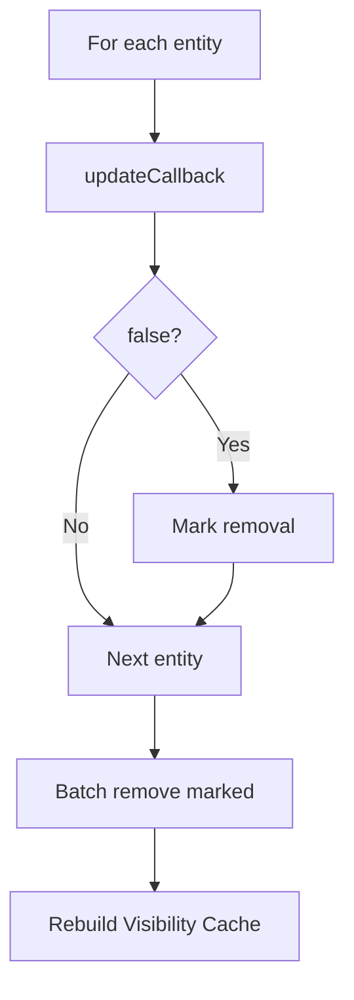

# Scene System Architecture

## Overview

The Scene system is SimpleFPS's **Entity-Component System** managing game objects, updates, visibility culling, and spatial partitioning (Octree) exclusively for physics.

## File Structure

```
app/src/engine/scene/
├── scene.js                  # Entity registry, update loop, visibility, raycasting
├── entity.js                 # Base Entity class + EntityTypes
├── lightgrid.js              # Volumetric lighting grid
├── meshentity.js, skinnedmeshentity.js, fpsmeshentity.js
├── skyboxentity.js
├── directionallightentity.js, pointlightentity.js, spotlightentity.js
├── animatedbillboardentity.js # Single-draw instanced billboards
└── particleemitterentity.js  # High-performance GPU-accelerated particles
```

## Entity Types

```javascript
EntityTypes = {
    MESH: 1,                // World geometry
    FPS_MESH: 2,            // Weapon/hands
    DIRECTIONAL_LIGHT: 3,   // Sun/moon
    POINT_LIGHT: 4,         // Torch/lamp
    SPOT_LIGHT: 5,          // Flashlight
    SKYBOX: 6,              // Environment
    SKINNED_MESH: 7,        // Animated characters
    ANIMATED_BILLBOARD: 8,  // Sprite animations (explosions, etc)
    PARTICLE_EMITTER: 9,    // Particle systems (sparks, smoke)
};
```

## Base Entity Class

**Properties:**
- `type`, `visible`, `base_matrix`, `ani_matrix`
- `boundingBox` (optional): AABB for frustum culling; entities without one are always visible
- `updateCallback`, `animationTime`

**Lifecycle:**
```javascript
const entity = new MeshEntity([x,y,z], "model.mesh", updateCallback);
Scene.addEntities(entity);      // Add to scene
entity.update(deltaTime);        // Per-frame (returns false = remove)
entity.render();                 // Via RenderPasses
Scene.removeEntity(entity);      // Cleanup (handles disposal of GPU queries)
```

## Scene API

```javascript
Scene.init();                          // Clear entities, reset static geometry
Scene.addEntities(entity);             // Add (single or array)
Scene.removeEntity(entity);            // Remove, dispose, and cleanup collidables
Scene.getEntities(EntityTypes.MESH);   // Query by type (O(1) via cached lists)
Scene.update(deltaTime);               // Update all + visibility + occlusion
Scene.pause(true);                     // Stop updates

// Static Geometry Merging
Scene.addStaticGeometry(entity);       // Merges entity mesh into global static trimesh
Scene.finalizeStaticGeometry();        // Finalizes merged trimesh for optimized raycasting

// Lighting
Scene.setAmbient([r,g,b]);
Scene.getAmbient(position);            // Lightgrid or global ambient
Scene.loadLightGrid(config);

// Physics
Scene.raycast(from, to, options);      // Fast intersection against all collidables
```

## Visibility

**Visibility Cache:** Type-segregated arrays of entities that passed frustum culling.
```javascript
Scene.visibilityCache = {
    [EntityTypes.MESH]: [...],
    [EntityTypes.POINT_LIGHT]: [...],
};
```

**Culling:** Per-entity AABB test against camera frustum planes each frame. Entities with no `boundingBox` are always visible (directional lights, skybox, etc.).

## Update Loop


```mermaid
flowchart TD
    Update[For each entity] --> Callback[updateCallback]
    Callback --> Remove{false?}
    Remove -->|Yes| Mark[Mark removal]
    Remove -->|No| Next[Next entity]
    Mark --> Next
    Next --> Cleanup[Batch remove marked]
    Cleanup --> Visibility[Rebuild Visibility Cache]
```

## Performance & Optimization

1. **Memory Efficiency:** All core systems (Scene, BoundingBox, Ray) use **module-scoped pre-allocated temporaries** to eliminate per-frame GC allocations.
2. **Batch Removal:** Entity removal is performed in-place using a `Set` for O(1) lookups and O(n) truncation to minimize array churn.
3. **Static Merging:** `Scene.addStaticGeometry` merges static mesh triangles into a single optimized `Trimesh` for fast raycasting.
4. **Instanced Billboards:** `ANIMATED_BILLBOARD` and `PARTICLE_EMITTER` use GPU instancing to render hundreds of sprites in a single draw call.

| Operation | Complexity | Optimization |
|-----------|-----------|--------------|
| `addEntities(arr)` | O(n) | Appends to typed lists and collidable arrays |
| `removeEntity()` | O(n) | In-place removal with typed list cleanup |
| `getEntities(type)` | O(1) | Returns pre-segregated typed lists |
| `update()` | O(n) | Skips `isStatic` entities; batch cleanup |
| `updateVisibility()` | O(n) | Per-entity frustum AABB test |
| `raycast()` | O(n) | Static geometry merging reduces collidable count |

## Console Commands

| Command | Effect |
|---------|--------|
| `tbv` | Toggle bounding volumes |
| `twf` | Toggle wireframes |
| `tlv` | Toggle light volumes |
| `tsk` | Toggle skeletons |
