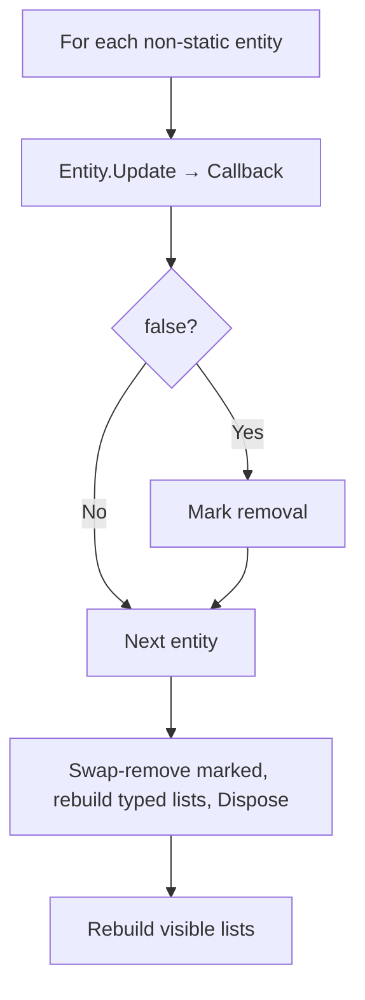

# Scene System Architecture

## Overview

The Scene system is SimpleFPS's entity registry: it owns game objects, drives their per-frame
updates, performs frustum culling, merges static geometry for raycasting, and implements every
`rendering.SceneSource` pass. It lives in GoFront packages `scene` and `animation`.

## File Structure

```
app/src/engine/scene/
├── entity.go                    # Entity interface, EntityBase, type constants
├── scene.go                     # Scene: entity lists, update, visibility, static geometry, raycasts
├── renderpasses.go              # SceneSource passes + debug console commands
├── lightgrid.go                 # Volumetric ambient light grid (trilinear)
├── meshentity.go                # World / FPS meshes
├── skinnedmeshentity.go         # Animated characters (bone matrices, skeleton debug)
├── lightentities.go             # Directional, point and spot lights
├── skyboxentity.go
├── animatedbillboardentity.go   # Sprite-sheet billboards (explosions)
├── particleemitterentity.go     # Instanced GPU particles
└── scene_test.go
app/src/engine/animation/
├── skeleton.go                  # Skeleton, Joint, Pose, skinning matrices
├── animation.go                 # Animation clips, binary parsing, sampling
├── animationplayer.go           # Playback state machine
└── animation_test.go
```

Dependency direction: `scene` → `animation`, `rendering`, `systems`, `physics`.
`rendering` never imports `scene`; it only sees the `SceneSource` interface.

## Entity Types

```go
const (
    TypeMesh              = 1 // World geometry
    TypeFPSMesh           = 2 // Weapon / hands
    TypeDirectionalLight  = 3 // Sun / moon
    TypePointLight        = 4 // Torch / lamp
    TypeSpotLight         = 5 // Flashlight
    TypeSkybox            = 6 // Environment
    TypeSkinnedMesh       = 7 // Animated characters
    TypeAnimatedBillboard = 8 // Sprite animations
    TypeParticleEmitter   = 9 // Particle systems
    TypeCount             = 10
)
```

## Entity Interface & EntityBase

GoFront has no embedded-field promotion, so entities use explicit composition: every entity
struct has a `Base EntityBase` field and returns it via `GetBase()`.

```go
type Entity interface {
    GetBase() *EntityBase
    Update(frameTime float32) bool          // false = remove from scene
    UpdateBoundingVolume()
    Render(probeColor []float32, renderMode string, shader *rendering.Shader)
    RenderShadow(renderMode string, shader *rendering.Shader)
    RenderWireFrame()
    Dispose()
}
```

`EntityBase` carries `Type`, `Visible`, `CastShadow`, `ReceiveShadow`, `IsStatic`,
`BaseMatrix`/`AniMatrix` (`physics.Mat4`), `BoundingBox` (nil = always visible), `Collider`
(`*physics.Trimesh` for dynamic raycasts), `UserData any`, the optional `Callback
UpdateCallback`, plus per-frame caches used by the render passes (probe colour, shadow height
state, skinned shadow sample position).

Entities never reach back into the scene. Anything camera- or scene-dependent is passed in:
probe colour, render mode and shader go into `Render`; `Scene` writes
`SkyboxEntity.CameraPosition` and `AnimatedBillboardEntity.CameraView` before drawing.

```go
e := scene.NewMeshEntity(scene.TypeMesh, physics.NewVec3(x, y, z), mesh, func(e scene.Entity, dt float32) bool {
    return true // keep alive
}, 1.0)
s.AddEntity(e)
```

Constructors: `NewMeshEntity`, `NewSkinnedMeshEntity`, `NewDirectionalLightEntity`,
`NewPointLightEntity`, `NewSpotLightEntity` (angle in degrees), `NewSkyboxEntity`,
`NewAnimatedBillboardEntity(position, *BillboardConfig)`, `NewParticleEmitterEntity`.

## Scene API

```go
s := scene.NewScene(camera)           // installs physics.GlobalRaycastStatic
s.AddEntity(e) / s.AddEntities(list)
s.RemoveEntity(e)                     // disposes, drops from typed + collidable lists
items, n := s.GetEntities(scene.TypeMesh)
items, n := s.VisibleEntities(scene.TypeMesh)
s.Update(frameTimeMs)                 // update, batch-remove, rebuild visibility
s.Pause(true)

// Static geometry
s.AddStaticGeometry(meshEntity)       // bakes world-space triangles into one Trimesh
s.FinalizeStaticGeometry()

// Lighting
s.SetAmbient(r, g, b)
s.Ambient(out)                        // black when a light grid is loaded
s.AmbientAt(position, out)            // light grid trilinear sample, else flat ambient
s.LightGrid().Load(cfg, data)

// Physics
s.Raycast(fx, fy, fz, tx, ty, tz, opts)         // collidables + static
s.RaycastStatic(...) / s.RaycastDynamic(...)
```

Typed lists return `(items, count)` — slices are fixed-capacity backing arrays, so always
iterate up to `count`, never `len(items)`.

## Animation

`animation.NewSkeleton(defs)` builds joints with inverse bind matrices. A `Pose` holds flat
position/rotation arrays per joint; `Skeleton.ComputeSkinningMatrices(pose)` writes into a
reused `[]physics.Mat4`. `Animation` clips come from `ParseBinaryAnimation` (with optional
per-frame `Bounds`) and are sampled by `AnimationPlayer.Update(dtSeconds)`.
`SkinnedMeshEntity.PlayAnimation(anim, reset)` drives the player each frame, flattens the
skinning matrices into its `boneMatrices` uniform array, and uses clip bounds for culling.

## Visibility

`UpdateVisibility` rebuilds one visible list per type by testing each entity's `BoundingBox`
against `physics.ActiveFrustumPlanes`. Entities without a box (directional lights, skybox)
are always visible. Render passes only read the visible lists.

## Update Loop


```mermaid
flowchart TD
    Update[For each non-static entity] --> Callback[Entity.Update → Callback]
    Callback --> Remove{false?}
    Remove -->|Yes| Mark[Mark removal]
    Remove -->|No| Next[Next entity]
    Mark --> Next
    Next --> Cleanup[Swap-remove marked, rebuild typed lists, Dispose]
    Cleanup --> Visibility[Rebuild visible lists]
```

## Render Passes

`Scene` implements `rendering.SceneSource`; `Renderer.Render` calls the passes in order.

| Pass | Behaviour |
|------|-----------|
| `RenderWorldGeometry` | Skybox (depth off), meshes in `"opaque"` mode with per-entity probe colour, skinned meshes via `SkinnedGeometry` |
| `RenderFPSGeometry` | FPS meshes in `"all"` mode |
| `RenderShadows` | Casters sorted by screen size; up to 16 static raycasts per frame resolve `ShadowHeight`; skinned casters re-sample every 3 frames or after moving |
| `RenderLighting` | Directional lights as screen quads, point/spot volumes sorted by contribution |
| `RenderTransparent` | Translucent meshes back-to-front by clip w, nearest 8 point / 4 spot lights uploaded through `LightingData` |
| `RenderBillboards` | Animated billboards, then particle emitters via `DrawInstanced` |
| `RenderDebug` | Bounding boxes (colour per type), wireframes, light volumes, skeletons |

## Performance & Optimization

1. **Zero per-frame allocation:** entity, visible, shadow and transparent lists are fixed-capacity
   arrays with a `Count`; scratch matrices/vectors are package-level; light sorting uses
   `rendering.LightSorter`. `scene_test.go` has a heap-growth guard running 50 full frames.
2. **Batch removal:** entities returning `false` are flagged and swap-removed after the update
   loop; typed lists are rebuilt once.
3. **Static merging:** `AddStaticGeometry` bakes triangles into a single `physics.Trimesh`
   with double-sided flags for translucent/double-sided/alpha materials, so raycasts skip
   per-entity colliders.
4. **Instancing:** particle emitters upload one instance buffer and issue one `DrawInstanced`.

## Console Commands

`scene.RegisterDebugCommands()` registers:

| Command | Effect |
|---------|--------|
| `tbv` | Toggle bounding volumes |
| `twf` | Toggle wireframes |
| `tlv` | Toggle light volumes |
| `tsk` | Toggle skeletons |
